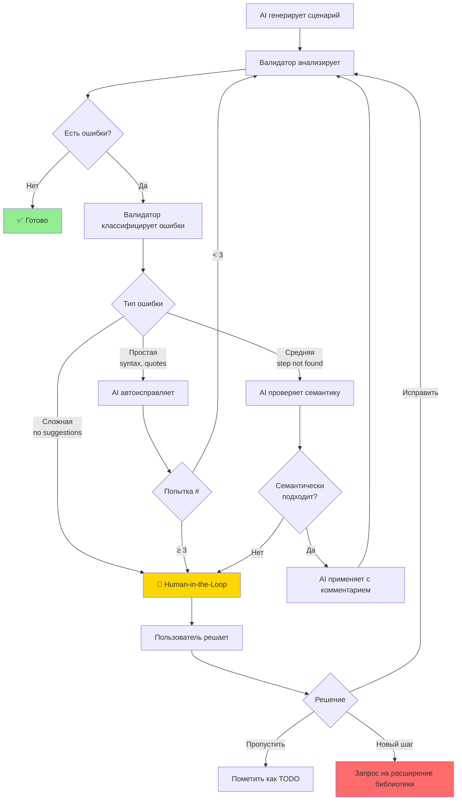

# Архитектура интеграции AI-ассистента с валидатором

> **Версия:** 1.0  
> **Дата:** 2025-11-28  
> **Статус:** Проектирование

---

## 🎯 Проблема

### Текущая ситуация

**Workflow:**
```
AI генерирует сценарий
  ↓
Валидатор находит ошибку
  ↓
Валидатор предлагает топ-5 похожих шагов (алгоритмическая схожесть 70%+)
  ↓
AI применяет первую рекомендацию
  ↓
Валидатор снова находит ошибку (рекомендация не подходит семантически)
  ↓
AI пытается исправить
  ↓
🔄 ЗАЦИКЛИВАНИЕ
```

### Ключевые проблемы

1. **Алгоритмическая схожесть ≠ Семантическая релевантность**
   - Схожесть 85%: `"я нажимаю на кнопку"` → `"я нажимаю на гиперссылку"`
   - Но это **разные UI элементы** → тест упадет

2. **Отсутствие механизма проверки**
   - AI не проверяет, подходит ли рекомендация по смыслу
   - Нет категоризации ошибок (критичные vs некритичные)

3. **Зацикливание**
   - AI пытается исправить → ошибка → пытается снова → ошибка
   - Нет выхода из цикла при невозможности автоисправления

4. **Отсутствие human-in-the-loop**
   - Нет механизма обращения к пользователю при сложных случаях

---

## 🏗️ Предлагаемая архитектура

### Общая концепция: Multi-Level Validation с Human-in-the-Loop



---

## 📊 Классификация ошибок валидации

### Уровень 1: Автоисправимые (Auto-Fix)

**Характеристики:**
- Однозначное правило исправления
- Не влияет на логику теста
- 100% безопасно

**Примеры:**

| Ошибка | Исправление | Действие AI |
|--------|-------------|-------------|
| Одинарные кавычки `'текст'` | Двойные кавычки `"текст"` | Автозамена |
| Отсутствует `# encoding: utf-8` | Добавить в начало | Автовставка |
| Отсутствует `# language: ru` | Добавить в начало | Автовставка |
| Отсутствует блок `Функционал:` | Добавить структуру | Автовставка |

**Workflow:**
```python
if error.type == "auto_fix":
    ai.apply_fix_directly(error.fix)
    # Без проверки семантики
```

---

### Уровень 2: Требующие проверки (Semantic Check Required)

**Характеристики:**
- Есть рекомендации, но требуется семантический анализ
- Может изменить логику теста
- Требует проверки AI

**Примеры:**

| Неверный шаг | Рекомендация | Семантическая проверка |
|--------------|--------------|------------------------|
| `я нажимаю кнопку "Создать"` | `я нажимаю на кнопку "Создать"` | ✅ Ок - только предлог |
| `я нажимаю кнопку "Создать"` | `я нажимаю на гиперссылку "Создать"` | ❌ Нет - другой элемент |
| `я ввожу в поле "Наименование"` | `в поле "Наименование" я ввожу текст` | ✅ Ок - тот же смысл |
| `я ввожу в поле "Наименование"` | `из выпадающего списка "Наименование" я выбираю` | ❌ Нет - другое действие |

**Workflow:**
```python
if error.type == "step_not_found" and error.has_suggestions:
    semantic_check = ai.analyze_semantic_relevance(
        original_step=error.step,
        suggestions=error.suggestions,
        context=scenario_context
    )
    
    if semantic_check.is_relevant:
        ai.apply_with_explanation(semantic_check.best_match)
    else:
        escalate_to_human(error, semantic_check.reason)
```

---

### Уровень 3: Критические - требуют human-in-the-loop (Escalate)

**Характеристики:**
- Нет подходящих рекомендаций
- AI не может определить семантическую релевантность
- Возможно нужен новый шаг в библиотеке

**Примеры:**

| Ситуация | Причина | Действие |
|----------|---------|----------|
| Нет рекомендаций (схожесть < 70%) | Возможно, новый функционал | Human decides |
| Все рекомендации семантически не подходят | Неправильный подход к тесту | Human reviews |
| AI зациклился (3+ попытки) | Сложный случай | Human intervention |

**Workflow:**
```python
if error.type == "critical" or attempts >= 3 or not semantic_check.is_confident:
    user_decision = ask_user(
        error=error,
        ai_analysis=semantic_check,
        context={
            "scenario": current_scenario,
            "attempts": attempts,
            "previous_fixes": history
        }
    )
```

---

## 🧠 Семантический анализ для AI

### Правила проверки релевантности

AI должен проверить каждую рекомендацию по этим критериям:

#### 1. Совпадение типа действия

```yaml
original_action: "нажимаю"
suggested_actions:
  - "нажимаю" → ✅ OK (100% match)
  - "кликаю" → ✅ OK (synonym)
  - "выбираю" → ⚠️ Check context
  - "ввожу" → ❌ Different action
```

**Категории действий:**
- **Клик**: нажимаю, кликаю, выбираю (на элемент)
- **Ввод**: ввожу, устанавливаю, задаю (значение)
- **Выбор**: выбираю из списка, выбираю по строке
- **Проверка**: проверяю, сравниваю, жду
- **Навигация**: открываю, перехожу, закрываю

#### 2. Совпадение типа UI элемента

```yaml
original_element: "кнопка"
suggested_elements:
  - "кнопка" → ✅ OK
  - "кнопка с именем" → ✅ OK (same element, different selector)
  - "гиперссылка" → ❌ Different UI element
  - "поле" → ❌ Different UI element
  - "таблица" → ❌ Different UI element
```

**Иерархия UI элементов:**
```
Кнопочные:
  - кнопка
  - кнопка с именем
  - кнопка командного интерфейса
  - кнопка выбора

Текстовые:
  - поле
  - поле с именем
  - поле ввода

Выборочные:
  - выпадающий список
  - список
  - дерево

Ссылочные:
  - гиперссылка
  - навигационная ссылка

Табличные:
  - таблица
  - дерево
```

#### 3. Совпадение контекста

```yaml
original_context: "в таблице \"Товары\""
suggested_contexts:
  - "в таблице" → ✅ OK (same context)
  - "в форме" → ⚠️ Different scope, check if valid
  - "" (без контекста) → ⚠️ Might work, but less specific
```

#### 4. Совпадение параметров

```yaml
original_params: ["Заголовок"]
suggested_params:
  - ["Заголовок"] → ✅ OK (caption)
  - ["ИмяЭлемента"] → ⚠️ Different selector (name vs caption)
  - ["Заголовок", "ДополнительныйПараметр"] → ⚠️ More params
```

---

## 🔧 Расширенный формат вывода валидатора

### Текущий формат (compact)

```yaml
---
report:
  errors:
    - line: 8
      step: "И я нажимаю кнопку \"Создать\""
      suggestions:
        - "И я нажимаю на кнопку \"Заголовок кнопки\""
        - "И я нажимаю на гиперссылку \"ТекстГиперссылки\""
---
```

### Предлагаемый формат с метаданными (ai-enhanced)

```yaml
---
report:
  errors:
    - line: 8
      type: "step_not_found"
      severity: "semantic_check_required"  # auto_fix | semantic_check_required | critical
      step: "И я нажимаю кнопку \"Создать\""
      
      # Парсинг оригинального шага
      parsed:
        action: "нажимаю"
        element_type: "кнопка"
        context: null
        params: ["Создать"]
      
      # Рекомендации с метаданными
      suggestions:
        - text: "И я нажимаю на кнопку \"Заголовок кнопки\""
          similarity: 0.95
          parsed:
            action: "нажимаю"
            element_type: "кнопка"
            context: null
            params: ["Заголовок кнопки"]
          semantic_match:
            action: true      # ✅ Действие совпадает
            element: true     # ✅ Тип элемента совпадает
            context: true     # ✅ Контекст совпадает
            params: false     # ⚠️ Параметр отличается (caption)
          confidence: "high"  # high | medium | low
          
        - text: "И я нажимаю на гиперссылку \"ТекстГиперссылки\""
          similarity: 0.87
          parsed:
            action: "нажимаю"
            element_type: "гиперссылка"
            context: null
            params: ["ТекстГиперссылки"]
          semantic_match:
            action: true      # ✅ Действие совпадает
            element: false    # ❌ Другой тип элемента!
            context: true
            params: false
          confidence: "low"   # ⚠️ Низкая уверенность из-за element mismatch
          warnings:
            - "Different UI element type: 'кнопка' vs 'гиперссылка'"
      
      # Рекомендация для AI
      ai_guidance:
        auto_applicable: false
        needs_human_review: false
        recommended_action: "Apply first suggestion with caution - parameter differs"
        escalate_if_fails: true
---
```

---

## 📋 Алгоритм работы AI с валидатором

### Псевдокод

```python
class AIValidator:
    MAX_ATTEMPTS = 3
    
    def validate_and_fix_scenario(self, scenario_file):
        attempts = 0
        history = []
        
        while attempts < self.MAX_ATTEMPTS:
            # 1. Запуск валидатора
            result = run_validator(scenario_file, format="ai-enhanced")
            
            if result.is_valid:
                return SUCCESS
            
            # 2. Классификация ошибок
            auto_fix_errors = [e for e in result.errors if e.severity == "auto_fix"]
            semantic_errors = [e for e in result.errors if e.severity == "semantic_check_required"]
            critical_errors = [e for e in result.errors if e.severity == "critical"]
            
            # 3. Автоисправление простых ошибок
            if auto_fix_errors:
                for error in auto_fix_errors:
                    apply_auto_fix(error)
                continue  # Повторная валидация
            
            # 4. Семантическая проверка
            if semantic_errors:
                for error in semantic_errors:
                    analysis = analyze_semantic_relevance(error)
                    
                    if analysis.confidence == "high" and analysis.is_safe:
                        apply_suggestion(analysis.best_match, explain=True)
                        history.append({"error": error, "fix": analysis, "attempt": attempts})
                    elif analysis.confidence == "medium":
                        # Спросить пользователя
                        user_choice = ask_user_decision(error, analysis)
                        if user_choice.apply:
                            apply_suggestion(user_choice.suggestion)
                        else:
                            mark_as_todo(error, user_choice.reason)
                            break
                    else:
                        # Низкая уверенность - к пользователю
                        escalate_to_human(error, analysis, history)
                        break
            
            # 5. Критические ошибки - сразу к пользователю
            if critical_errors:
                for error in critical_errors:
                    escalate_to_human(error, reason="No suitable suggestions", history=history)
                break
            
            attempts += 1
        
        # 6. Зациклились - к пользователю
        if attempts >= self.MAX_ATTEMPTS:
            escalate_to_human(
                errors=result.errors,
                reason="Maximum attempts reached without resolution",
                history=history
            )
    
    def analyze_semantic_relevance(self, error):
        """
        Анализ семантической релевантности рекомендаций
        """
        original = error.parsed
        results = []
        
        for suggestion in error.suggestions:
            suggested = suggestion.parsed
            
            # Проверяем совпадение по каждому критерию
            match_score = {
                "action": self.compare_actions(original.action, suggested.action),
                "element": self.compare_elements(original.element_type, suggested.element_type),
                "context": self.compare_context(original.context, suggested.context),
                "params": self.compare_params(original.params, suggested.params)
            }
            
            # Вычисляем общую уверенность
            confidence = self.calculate_confidence(match_score, suggestion.similarity)
            
            # Проверяем безопасность замены
            is_safe = (
                match_score["action"] >= 0.9 and
                match_score["element"] >= 0.9 and
                (match_score["context"] >= 0.7 or original.context is None)
            )
            
            results.append({
                "suggestion": suggestion,
                "match_score": match_score,
                "confidence": confidence,
                "is_safe": is_safe,
                "warnings": self.generate_warnings(match_score)
            })
        
        # Сортируем по безопасности и уверенности
        results.sort(key=lambda x: (x["is_safe"], x["confidence"]), reverse=True)
        
        return AnalysisResult(
            best_match=results[0] if results else None,
            all_matches=results,
            confidence=results[0]["confidence"] if results else "none",
            is_safe=results[0]["is_safe"] if results else False
        )
    
    def escalate_to_human(self, error, reason, history):
        """
        Обращение к пользователю за помощью
        """
        message = f"""
🤝 **Требуется ваша помощь**

**Ошибка в строке {error.line}:**
```gherkin
{error.step}
```

**Причина обращения:** {reason}

**Рекомендации валидатора:**
{self.format_suggestions(error.suggestions)}

**История попыток исправления:**
{self.format_history(history)}

**Возможные действия:**
1. ✏️ Исправить шаг вручную
2. 📝 Выбрать одну из рекомендаций
3. 🆕 Запросить добавление нового шага в библиотеку
4. ⏭️ Пропустить (пометить как @Draft)

**Ваш выбор?**
"""
        
        return ask_user(message, options=[
            "Исправить вручную",
            "Применить рекомендацию #1",
            "Применить рекомендацию #2",
            "Запросить новый шаг",
            "Пропустить как @Draft"
        ])
```

---

## 🎯 Промпт-инструкции для AI

### Базовый промпт для работы с валидатором

```markdown
# Правила работы с валидатором Vanessa Automation

## Общий workflow

1. **Генерация сценария** → создаю .feature файл
2. **Запуск валидатора** → `validate.py scenario.feature --ai-enhanced`
3. **Анализ результата** → классифицирую ошибки
4. **Применение исправлений** → по уровням сложности
5. **Проверка** → повторная валидация (макс 3 попытки)

## Классификация ошибок

### Уровень 1: Автоисправление (без проверки)
- Синтаксис кавычек
- Отсутствующие заголовки
- Кодировка файла

**Действие:** Исправляю немедленно, повторяю валидацию.

### Уровень 2: Семантическая проверка (обязательна!)

**КРИТИЧЕСКИ ВАЖНО:** Перед применением рекомендации ОБЯЗАТЕЛЬНО проверяю:

✅ **Совпадает ли ДЕЙСТВИЕ?**
```
"нажимаю" → "нажимаю" ✅
"нажимаю" → "ввожу" ❌ СТОП! Другое действие!
```

✅ **Совпадает ли ТИП ЭЛЕМЕНТА?**
```
"кнопка" → "кнопка с именем" ✅ (тот же элемент, другой селектор)
"кнопка" → "гиперссылка" ❌ СТОП! Другой UI элемент!
"поле" → "выпадающий список" ❌ СТОП! Разные элементы!
```

✅ **Совпадает ли КОНТЕКСТ?**
```
"в таблице" → "в таблице" ✅
"в таблице" → "в форме" ⚠️ Проверить, может ли это работать
```

**Если хотя бы одна проверка failed → НЕ ПРИМЕНЯЮ, обращаюсь к пользователю!**

### Уровень 3: Human-in-the-Loop (обязательное обращение)

Обращаюсь к пользователю если:
- ❌ Нет подходящих рекомендаций (similarity < 70%)
- ❌ Все рекомендации семантически не подходят
- ❌ Уже 3 попытки исправления, но ошибка остается
- ❌ Не уверен в релевантности (confidence < medium)

## Защита от зацикливания

**ОБЯЗАТЕЛЬНО:**
```python
attempt_counter = 0
MAX_ATTEMPTS = 3

while валидация_не_прошла and attempt_counter < MAX_ATTEMPTS:
    apply_fixes()
    attempt_counter += 1

if attempt_counter >= MAX_ATTEMPTS:
    escalate_to_human(reason="Не удалось исправить за 3 попытки")
```

## Формат обращения к пользователю

```
🤝 Требуется ваша помощь

Не могу автоматически исправить ошибку в строке {line}:
❌ {original_step}

Валидатор предлагает:
1. {suggestion_1} (схожесть: {similarity}%)
   ⚠️ Предупреждение: {semantic_warning}

2. {suggestion_2} (схожесть: {similarity}%)
   ⚠️ Предупреждение: {semantic_warning}

Причина обращения: {reason}

Что делать?
1. Применить рекомендацию #1
2. Применить рекомендацию #2
3. Исправить вручную
4. Пропустить (отметить @Draft)
```

## Примеры анализа

### ✅ Пример ПРАВИЛЬНОГО применения

**Ошибка:**
```gherkin
И я нажимаю кнопку "Создать"
```

**Рекомендация:**
```gherkin
И я нажимаю на кнопку "Заголовок кнопки"
```

**Семантический анализ:**
- Действие: "нажимаю" → "нажимаю" ✅
- Элемент: "кнопка" → "кнопка" ✅
- Контекст: none → none ✅
- Параметр: "Создать" → "Заголовок кнопки" (просто шаблон) ✅

**Решение:** ✅ ПРИМЕНЯЮ с заменой параметра на "Создать"

### ❌ Пример НЕПРАВИЛЬНОГО применения

**Ошибка:**
```gherkin
И я нажимаю кнопку "Создать"
```

**Рекомендация:**
```gherkin
И я нажимаю на гиперссылку "ТекстГиперссылки"
```

**Семантический анализ:**
- Действие: "нажимаю" → "нажимаю" ✅
- Элемент: "кнопка" → "гиперссылка" ❌ РАЗНЫЕ ЭЛЕМЕНТЫ!
- Similarity: 87% (высокая!)

**Решение:** ❌ НЕ ПРИМЕНЯЮ! Обращаюсь к пользователю:
```
⚠️ Рекомендация имеет высокую схожесть (87%), но семантически не подходит:
   - Оригинал: кнопка
   - Рекомендация: гиперссылка
   
Это разные UI элементы! Нужно ваше решение.
```
```

---

## 🔄 Примеры workflow

### Сценарий 1: Успешное автоисправление

```
1. AI генерирует:
   И я нажимаю на кнопку 'Создать'

2. Валидатор:
   ❌ Строка 8: Одинарные кавычки
   Severity: auto_fix
   Fix: Заменить ' на "

3. AI:
   ✅ Автоматически исправляю
   И я нажимаю на кнопку "Создать"

4. Валидатор:
   ✅ Сценарий валиден
```

---

### Сценарий 2: Семантическая проверка OK

```
1. AI генерирует:
   И я нажимаю кнопку "Создать"

2. Валидатор:
   ❌ Шаг не найден
   Severity: semantic_check_required
   Suggestions:
     1. "И я нажимаю на кнопку \"{}\"" (similarity: 95%)
        - action: match ✅
        - element: match ✅
        - confidence: high

3. AI семантический анализ:
   ✅ Действие совпадает: нажимаю
   ✅ Элемент совпадает: кнопка
   ✅ Confidence: high
   ✅ Is safe: true

4. AI применяет:
   И я нажимаю на кнопку "Создать"
   
   💬 Комментарий: Добавлен предлог "на" согласно синтаксису библиотеки

5. Валидатор:
   ✅ Сценарий валиден
```

---

### Сценарий 3: Семантическая проверка FAILED → Human-in-the-Loop

```
1. AI генерирует:
   И я ввожу в поле "Наименование" текст "Тест"

2. Валидатор:
   ❌ Шаг не найден
   Suggestions:
     1. "И в поле \"{}\" я ввожу текст \"{}\""  (similarity: 92%)
     2. "Из выпадающего списка \"{}\" я выбираю по строке \"{}\""  (similarity: 78%)

3. AI семантический анализ suggestion #1:
   ✅ Действие: "ввожу" → "ввожу" (match)
   ✅ Элемент: "поле" → "поле" (match)
   ⚠️ Порядок слов: другой
   ✅ Confidence: high
   ✅ Is safe: true

4. AI применяет suggestion #1:
   И в поле "Наименование" я ввожу текст "Тест"
   
5. Валидатор:
   ✅ Сценарий валиден
```

---

### Сценарий 4: Зацикливание → Human-in-the-Loop

```
1. AI генерирует:
   И я выбираю товар из справочника "Номенклатура"

2. Валидатор (попытка #1):
   ❌ Шаг не найден
   Suggestion: "И из выпадающего списка \"{}\" я выбираю по строке \"{}\""

3. AI применяет:
   И из выпадающего списка "Номенклатура" я выбираю по строке ""
   ⚠️ Не заполнен второй параметр!

4. Валидатор (попытка #2):
   ❌ Шаг все еще неверен

5. AI пытается исправить:
   И из выпадающего списка "Номенклатура" я выбираю по строке "товар"

6. Валидатор (попытка #3):
   ❌ Параметры не соответствуют контексту

7. AI достиг MAX_ATTEMPTS (3):
   🤝 Escalate to Human:
   
   ```
   Не удалось автоматически исправить за 3 попытки.
   
   Исходный шаг:
   И я выбираю товар из справочника "Номенклатура"
   
   История попыток:
   1. Применена рекомендация, но не хватает параметра
   2. Добавлен параметр "товар", но контекст неверный
   3. ...
   
   Рекомендации валидатора:
   1. "И из выпадающего списка \"{}\" я выбираю по строке \"{}\""
   
   Возможно, нужен другой подход к тестированию?
   
   Ваше решение:
   [ ] Исправить вручную
   [ ] Использовать другой шаг для выбора из справочника
   [ ] Добавить новый шаг в библиотеку
   ```
```

---

## 🛠️ Технические требования к реализации

### 1. Модификация валидатора

**Файл:** `tools/validator/validate.py`

**Добавить:**
1. Парсер шагов для извлечения action, element_type, context, params
2. Семантический матчинг для каждой рекомендации
3. Новый формат вывода `--ai-enhanced`
4. Классификация severity ошибок

**Пример кода:**
```python
# См. следующий файл в архитектуре
```

### 2. Промпт-расширение для AI

**Файл:** `ai-knowledge/validator-integration-guide.md`

Добавить в base knowledge:
- Правила семантической проверки
- Алгоритм защиты от зацикливания
- Примеры правильного/неправильного применения

### 3. Шаблоны для user interaction

**Файл:** `templates/prompts/human-in-the-loop-templates.md`

Готовые шаблоны сообщений для разных случаев escalation.

---

## 📈 Метрики успешности

### Целевые показатели

| Метрика | Текущее | Целевое |
|---------|---------|---------|
| Автоисправление (Lvl 1) | 0% | 100% |
| Правильное применение рекомендаций (Lvl 2) | ~30% | >90% |
| Зацикливания | Частые | 0 |
| Обращений к пользователю (некритичных) | 0% | <10% |
| Скорость валидации | N/A | <5 сек |

---

## 📚 Дальнейшее развитие

### Фаза 1: MVP (текущий документ)
- ✅ Архитектура
- ⏳ Парсер шагов
- ⏳ Семантический matcher
- ⏳ Промпт для AI

### Фаза 2: Обучение на данных
- Накопление истории исправлений
- ML-модель для предсказания релевантности
- Автоматическая категоризация новых ошибок

### Фаза 3: Расширение библиотеки
- Автоматические PR для новых шагов
- Crowdsourcing валидации шагов
- Версионирование библиотеки

---

## 🔗 Связанные документы

- [`validator-enhancement-spec.md`](validator-enhancement-spec.md) - Техническая спецификация изменений валидатора
- [`ai-semantic-rules.md`](ai-semantic-rules.md) - Полный набор правил семантической проверки
- [`human-in-the-loop-guide.md`](human-in-the-loop-guide.md) - Руководство по взаимодействию с пользователем
