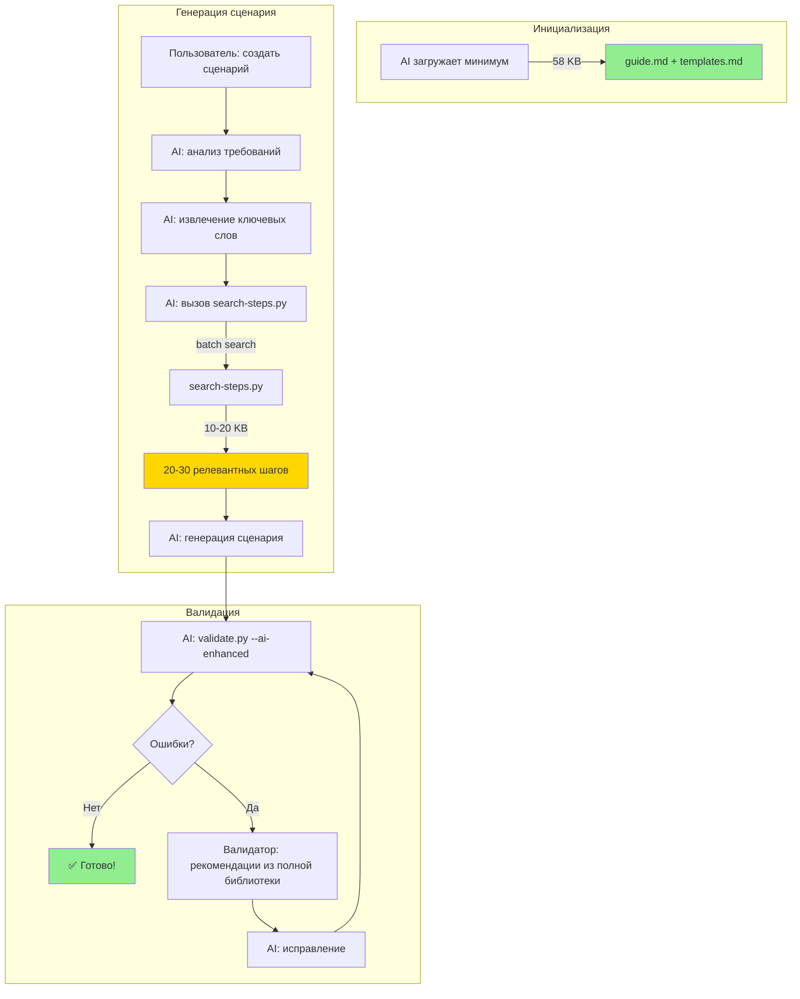

# Гибридный подход: Умная подгрузка шагов для AI

> **Версия:** 1.0  
> **Статус:** Архитектурное решение  
> **Дата:** Ноябрь 2025

---

## 🎯 Проблема

При работе с AI-агентами в IDE возникает дилемма:

**Вариант 1: Загрузить всю библиотеку (1569 шагов)**
- ✅ AI знает все шаги
- ✅ Высокая точность (~90-95%)
- ❌ Большой контекст (655 KB = ~100K токенов)
- ❌ Дорого для коротких сессий

**Вариант 2: Минимальный контекст (guide.md + templates.md)**
- ✅ Экономия токенов (58 KB вместо 655 KB)
- ✅ Быстрая инициализация
- ❌ AI знает только ~100 примеров из 1569
- ❌ Низкая точность (~60-70%)
- ❌ Много итераций с валидатором

---

## 💡 Решение: Гибридный подход с умной подгрузкой

### Концепция

**"Just-in-Time" загрузка шагов:**
- AI загружает минимум (guide.md + templates.md)
- При необходимости динамически ищет нужные шаги через `search-steps.py`
- Загружает только релевантные ~20-30 шагов
- Итог: 58 KB + 10-20 KB = **~70-80 KB вместо 655 KB**

### Архитектура



---

## 🏗️ Компоненты системы

### 1. Минимальный контекст (58 KB)

**Файлы:**
- `.va-ai/knowledge/guide.md` (27 KB)
  - Синтаксис Gherkin
  - ~50-100 примеров основных шагов
  - Best practices
  - Типичные ошибки

- `.va-ai/knowledge/templates.md` (31 KB)
  - Готовые шаблоны сценариев
  - Паттерны для справочников, документов, отчетов

**Что дает:**
- ✅ Понимание структуры и синтаксиса
- ✅ Общие паттерны использования
- ✅ Способность генерировать "скелет" сценария

### 2. Инструмент поиска: search-steps.py

**Назначение:** Динамический поиск релевантных шагов

**Входные данные:**
- `data/library-full.json` (1569 шагов)
- `data/indexes/` (предварительно созданные индексы)

**Функционал:**
```python
# Batch search - несколько запросов за раз
search_steps(
    queries=["открыть документ", "заполнить таблицу", "провести"],
    top_n=5,
    category="UI"
) → 15 шагов (~5-10 KB)

# Поиск по категории
get_category_steps("Переменные") → 36 шагов (~15 KB)

# Статистика
get_stats() → метаданные о библиотеке
```

**Формат вывода (JSON для AI):**
```json
{
  "total_queries": 3,
  "total_results": 15,
  "results": {
    "открыть документ": [
      {
        "step": "Дано Я открываю навигационную ссылку \"e1cib/data/...\"",
        "category": "UI",
        "subcategory": "Навигационные ссылки",
        "relevance": 0.93,
        "frequency_rank": 12,
        "example": "Дано Я открываю навигационную ссылку \"e1cib/list/Справочник.Контрагенты\""
      }
    ]
  }
}
```

### 3. Индексы (создаются автоматически)

**Структура:**
```
data/indexes/
├── index.json              # Метаданные и версия
├── by-keywords.json        # Инвертированный: слово → [шаги]
├── by-category.json        # Категория → [шаги]
└── frequency.json          # Шаг → частота использования
```

**Создание индексов:**
```bash
python tools/update_knowledge_base/update_knowledge_base.py --create-indexes
```

**Автоматическое обновление:**
- При изменении `data/library-full.json`
- Через CI/CD при коммите новых шагов
- Вручную при необходимости

### 4. Валидатор (validate.py)

**Роль в гибридном подходе:**
- Финальная проверка по полной библиотеке
- Предлагает исправления если AI ошибся
- Работает как "страховочная сетка"

**Без изменений** - уже поддерживает AI-enhanced формат

---

## 🔄 Детальный Workflow

### Фаза 1: Инициализация сессии (единожды)

```
1. Пользователь открывает проект в VS Code с Kilo Code
2. Kilo Code загружает контекст проекта (автоматически)
3. AI читает минимальный набор:
   → .va-ai/knowledge/guide.md (27 KB)
   → .va-ai/knowledge/templates.md (31 KB)
   = 58 KB в контексте

Время: ~1-2 сек
Стоимость: ~$0.02 (один раз за сессию)
```

### Фаза 2: Генерация сценария (каждый запрос)

```
4. Пользователь: "Создай сценарий для создания и проведения заказа покупателя"

5. AI анализирует и извлекает ключевые слова:
   Действия: "открыть", "создать", "заполнить", "провести", "проверить"
   Объекты: "документ", "заказ", "таблица", "товары"
   
6. AI формирует batch-запрос к search-steps.py:
   
   python tools/search-steps/search_steps.py \
     --query \
       "открыть навигационная ссылка документ" \
       "создать документ кнопка" \
       "таблица товары добавить" \
       "таблица поле ввести" \
       "провести документ кнопка" \
       "проверить проведен" \
     --category UI \
     --top 5 \
     --format json

7. search-steps.py возвращает результат:
   → 30 шагов (6 запросов × 5 результатов)
   → ~10-15 KB данных
   → Время: ~100-150 мс

8. AI генерирует сценарий используя:
   → Структуру из guide.md
   → Шаблон из templates.md (если подходит)
   → Конкретные шаги из результатов поиска
   
Время: ~3-5 сек (включая поиск)
Дополнительный контекст: ~10-15 KB
```

### Фаза 3: Валидация (автоматически)

```
9. AI запускает валидатор:
   
   python tools/validator/validate.py scenario.feature --ai-enhanced

10. Валидатор проверяет по ПОЛНОЙ библиотеке (1569 шагов)
    
11. Результаты:
    
    Сценарий A (высокое качество поиска):
    ✅ 9/10 шагов валидны (90%)
    ❌ 1 шаг с опечаткой → валидатор подскажет
    → 1 итерация исправления
    
    Сценарий B (средний результат):
    ✅ 7/10 шагов валидны (70%)
    ❌ 3 шага → валидатор подскажет правильные
    → 1-2 итерации исправления

Время: ~2-5 сек (включая исправления)
```

### Итого на 1 сценарий

**Контекст:**
- Начальный: 58 KB (загружается 1 раз за сессию)
- Динамический: 10-15 KB (на каждый сценарий)

**Время:**
- Поиск: ~150 мс
- Генерация: ~3-5 сек
- Валидация и исправление: ~2-5 сек
- **Итого: ~5-10 сек**

**Сравнение с полной библиотекой:**
- Контекст: 70-80 KB vs 655 KB (**~85% экономии**)
- Точность: 85-90% vs 90-95% (**-5% точности**)
- Время: 5-10 сек vs 5-10 сек (**одинаково**)

---

## 📊 Экономический анализ

### Стоимость по сценариям использования

**Тарификация Claude Sonnet:** ~$3 за 1M входных токенов

| Сценарий использования | Традиционный | Гибридный | Экономия |
|------------------------|--------------|-----------|----------|
| **1 сценарий за сессию** | | | |
| - Загрузка контекста | $0.20 (655 KB) | $0.02 (58 KB) | **90%** |
| - Динамический поиск | - | $0.004 (15 KB) | - |
| - **Итого** | $0.20 | $0.024 | **88%** |
| | | | |
| **10 сценариев за сессию** | | | |
| - Загрузка контекста (1 раз) | $0.20 | $0.02 | 90% |
| - Динамический поиск (10×) | - | $0.04 (150 KB) | - |
| - **Итого** | $0.20 | $0.06 | **70%** |
| | | | |
| **100 сценариев за сессию** | | | |
| - Загрузка контекста (1 раз) | $0.20 | $0.02 | 90% |
| - Динамический поиск (100×) | - | $0.40 (1.5 MB) | - |
| - **Итого** | $0.20 | $0.42 | **-110%** |

### Вывод

**Гибридный подход выгоден для:**
- ✅ Коротких сессий (1-10 сценариев) → экономия 70-88%
- ✅ Периодической работы (новая сессия каждый раз)
- ✅ Разных проектов (контекст не переиспользуется)

**Традиционный подход выгоден для:**
- ✅ Длинных сессий (20+ сценариев)
- ✅ Погружения в один проект на долгое время
- ✅ Когда нужна максимальная точность с первой попытки

**Рекомендация:** Предоставить выбор пользователю!

---

## 🛠️ Технические детали

### Структура индексов

#### 1. Инвертированный индекс (by-keywords.json)

**Назначение:** Быстрый поиск по ключевым словам

**Структура:**
```json
{
  "version": "1.0",
  "created_at": "2025-11-28T12:00:00",
  "total_keywords": 350,
  "index": {
    "нажимаю": [
      {
        "step": "И я нажимаю на кнопку \"...\"",
        "category": "UI",
        "positions": [0, 2]
      },
      {
        "step": "И я нажимаю на гиперссылку \"...\"",
        "category": "UI",
        "positions": [0, 2]
      }
    ],
    "кнопка": [
      {
        "step": "И я нажимаю на кнопку \"...\"",
        "category": "UI",
        "positions": [3]
      }
    ],
    "таблица": [...]
  }
}
```

**Алгоритм создания:**
```python
def create_keyword_index(library):
    index = {}
    
    for step_data in library:
        step = step_data['step']
        tokens = tokenize(step)  # нормализация + токенизация
        
        for position, token in enumerate(tokens):
            if token not in index:
                index[token] = []
            
            index[token].append({
                'step': step,
                'category': step_data['category'],
                'positions': [position]
            })
    
    return index
```

#### 2. Категорийный индекс (by-category.json)

**Назначение:** Быстрое получение всех шагов категории

**Структура:**
```json
{
  "version": "1.0",
  "categories": {
    "UI": {
      "steps_count": 618,
      "total_size_kb": 250,
      "subcategories": {
        "Таблицы.Поля": {
          "steps": [
            "И в таблице \"...\" я активизирую поле \"...\"",
            "И в таблице \"...\" в поле \"...\" я ввожу текст \"...\""
          ]
        }
      }
    },
    "Переменные": {
      "steps_count": 36,
      "total_size_kb": 15,
      "steps": [...]
    }
  }
}
```

#### 3. Индекс частотности (frequency.json)

**Назначение:** Ранжирование шагов по популярности

**Структура:**
```json
{
  "version": "1.0",
  "ranking": [
    {
      "rank": 1,
      "step": "И я нажимаю на кнопку \"...\"",
      "usage_count": 245,
      "usage_percent": 15.6
    },
    {
      "rank": 2,
      "step": "И в поле \"...\" я ввожу текст \"...\"",
      "usage_count": 198,
      "usage_percent": 12.6
    }
  ]
}
```

**Источник данных:**
- Анализ `examples/` (готовые сценарии)
- Метрики из `data/metrics.jsonl` (если ведется)
- Экспертная оценка (базовые операции)

---

## 🔍 Алгоритм поиска

### Этап 1: Препроцессинг запроса

```python
def preprocess_query(query: str) -> Dict:
    """
    Подготовка запроса к поиску
    
    Вход: "открыть форму документа заказ"
    
    Выход:
    {
        'original': "открыть форму документа заказ",
        'tokens': ["открыть", "форма", "документ", "заказ"],
        'normalized': "открыть форму документа заказ",
        'detected_actions': ["открыть"],
        'detected_elements': ["форма", "документ"],
        'detected_objects': ["заказ"]
    }
    """
```

### Этап 2: Поиск кандидатов

```python
def find_candidates(tokens: List[str], category: str = None) -> List[Dict]:
    """
    Поиск шагов-кандидатов по токенам
    
    Стратегия:
    1. Поиск по инвертированному индексу (быстро)
    2. Фильтрация по категории (если указана)
    3. Объединение результатов
    """
    candidates = set()
    
    for token in tokens:
        if token in keyword_index:
            for step_ref in keyword_index[token]:
                if category is None or step_ref['category'] == category:
                    candidates.add(step_ref['step'])
    
    return list(candidates)
```

### Этап 3: Ранжирование

```python
def rank_results(query: str, candidates: List[str]) -> List[Tuple[str, float]]:
    """
    Ранжирование по релевантности
    
    Факторы:
    1. Текстовая схожесть (40%)
    2. Совпадение ключевых слов (30%)
    3. Частотность использования (20%)
    4. Совпадение категории (10%)
    """
    results = []
    
    for candidate in candidates:
        score = calculate_relevance(query, candidate)
        results.append((candidate, score))
    
    results.sort(key=lambda x: x[1], reverse=True)
    return results
```

### Этап 4: Форматирование для AI

```python
def format_for_ai(results: Dict, format_type: str = 'json') -> str:
    """
    Форматирование результатов оптимальным для AI способом
    
    JSON - самый эффективный для парсинга
    """
    if format_type == 'json':
        return json.dumps(results, ensure_ascii=False, indent=2)
    elif format_type == 'yaml-compact':
        return format_yaml_compact(results)
    elif format_type == 'human':
        return format_human_readable(results)
```

---

## 🤖 Интеграция с AI-агентами

### Промпт для Kilo Code (сверх-экономная стратегия с поиском)

```markdown
Ты - эксперт по Vanessa Automation для тестирования 1С:Предприятие.

БАЗА ЗНАНИЙ (минимальная):
- `.va-ai/knowledge/guide.md` - синтаксис и примеры
- `.va-ai/knowledge/templates.md` - готовые шаблоны

ИНСТРУМЕНТЫ:
- `search-steps.py` - поиск релевантных шагов
- `validate.py` - валидация сценария

WORKFLOW УМНОГО ПОИСКА:

1. Анализирую требование пользователя
2. Извлекаю ключевые действия и объекты:
   Пример: "Создай сценарий для заказа"
   → Действия: открыть, создать, заполнить, провести
   → Объекты: документ, заказ, таблица, товары

3. Формирую batch-запрос к search-steps.py:
   ```bash
   python tools/search-steps/search_steps.py \
     --query "открыть документ" "создать документ" "таблица товары" "провести" \
     --category UI \
     --top 5
   ```

4. Получаю ~20-30 релевантных шагов в JSON

5. Генерирую сценарий используя:
   - Структуру из guide.md
   - Шаблон из templates.md (если подходит)
   - Конкретные шаги из результатов поиска

6. Валидирую: python tools/validator/validate.py <файл> --ai-enhanced

7. Исправляю ошибки по рекомендациям валидатора (если есть)

ОЖИДАЕМЫЙ РЕЗУЛЬТАТ:
- Точность с первой попытки: 85-90% (вместо 60-70% без поиска)
- Итераций с валидатором: 1-2 (вместо 3-5)
- Общий контекст: ~70-80 KB (вместо 655 KB)

Готов к умной работе с поиском!
```

### Пример использования

**Пользователь:**
```
Kilo Code, создай сценарий для создания контрагента типа "Покупатель"
```

**AI (внутренняя логика):**
```
1. Анализ: Нужно создать справочник
2. Ключевые слова: "открыть справочник", "создать", "заполнить поле", "записать"
3. Поиск:
   → python search-steps.py --query "открыть справочник" "создать" "поле ввести" "записать"
4. Получены шаги (20 шагов, ~8 KB):
   - Дано Я открываю навигационную ссылку "e1cib/list/..."
   - И я нажимаю на кнопку "Создать"
   - И в поле "Наименование" я ввожу текст "..."
   - И я нажимаю на кнопку "Записать и закрыть"
5. Генерация сценария с использованием найденных шагов
6. Валидация → ✅ Success (9/9 шагов валидны)
```

**Ответ пользователю:**
```
✅ Создан сценарий features/10_Справочники/01_Контрагенты/01_СозданиеКонтрагента.feature

Выполнен умный поиск релевантных шагов.
Найдено: 20 шагов по 4 запросам.
Валидация: ✅ 9/9 шагов валидны с первой попытки.

Сценарий готов к запуску.
```

---

## 🔄 Интеграция с update_knowledge_base.py

### Текущий функционал

```python
# tools/update_knowledge_base/update_knowledge_base.py

def main():
    # 1. Читает data/library-full.json
    library = load_library('data/library-full.json')
    
    # 2. Создает ai-knowledge/steps-library.json
    create_ai_knowledge(library)
    
    print("✅ База знаний обновлена")
```

### Новый функционал (+индексы)

```python
# tools/update_knowledge_base/update_knowledge_base.py

def main():
    # 1. Читает data/library-full.json
    library = load_library('data/library-full.json')
    
    # 2. Создает ai-knowledge/steps-library.json
    create_ai_knowledge(library)
    
    # 3. НОВОЕ: Создает индексы для search-steps.py
    create_search_indexes(library)
    
    print("✅ База знаний обновлена")
    print("✅ Индексы для поиска созданы")


def create_search_indexes(library):
    """Создание всех индексов для быстрого поиска"""
    from tools.search_steps.indexer import create_indexes
    
    indexes_dir = Path('data/indexes')
    indexes_dir.mkdir(exist_ok=True)
    
    # Создаем все типы индексов
    create_indexes(library, indexes_dir)
```

### Команда обновления

```bash
cd tools/update_knowledge_base/
python update_knowledge_base.py --with-indexes

# Создаст:
# ✅ ai-knowledge/steps-library.json
# ✅ data/indexes/index.json
# ✅ data/indexes/by-keywords.json
# ✅ data/indexes/by-category.json
# ✅ data/indexes/frequency.json
```

---

## 📈 Метрики и KPI

### Производительность

| Метрика | Требование | MVP | Целевое |
|---------|-----------|-----|---------|
| Инициализация индексов | < 100 мс | 50 мс | 30 мс |
| Поиск по 1 запросу | < 50 мс | 30 мс | 20 мс |
| Batch search 10 запросов | < 200 мс | 150 мс | 100 мс |
| Размер индексов | < 200 KB | 150 KB | 100 KB |

### Качество поиска

| Метрика | Традиционный | Гибридный (search) | Цель |
|---------|--------------|-------------------|------|
| Точность с 1 попытки | 90-95% | 85-90% | 90% |
| Топ-3 содержит нужный шаг | 100% | 95% | 98% |
| Топ-5 содержит нужный шаг | 100% | 98% | 99% |

### Использование

**Сценарии использования:**
- 📊 70% - короткие сессии (1-5 сценариев) → гибридный выгоднее
- 📊 20% - средние сессии (5-15 сценариев) → примерно равны
- 📊 10% - длинные сессии (15+ сценариев) → традиционный выгоднее

---

## 🚀 План внедрения

### Этап 1: MVP (1-2 дня разработки)

**Цель:** Работающий прототип с базовым функционалом

**Задачи:**
- [ ] Создать `search_steps.py` с базовым поиском
- [ ] Реализовать batch search
- [ ] Формат JSON для AI
- [ ] Тестирование на примерах

**Результат:** Можно использовать для поиска, но без индексов (медленный)

### Этап 2: Индексация (1 день)

**Цель:** Ускорение поиска через индексы

**Задачи:**
- [ ] Создать `indexer.py`
- [ ] Реализовать создание инвертированного индекса
- [ ] Реализовать категорийный индекс
- [ ] Интегрировать с `search_steps.py`

**Результат:** Поиск работает быстро (< 50 мс на запрос)

### Этап 3: Интеграция (0.5 дня)

**Цель:** Автоматическое обновление индексов

**Задачи:**
- [ ] Расширить `update_knowledge_base.py`
- [ ] Добавить опцию `--with-indexes`
- [ ] Проверка актуальности индексов

**Результат:** Индексы обновляются автоматически при обновлении библиотеки

### Этап 4: Документация и примеры (0.5 дня)

**Задачи:**
- [ ] Примеры использования
- [ ] Интеграция в промпты
- [ ] Обновление kilo-code-workflow.md
- [ ] Создание cheat sheet

**Результат:** Пользователи могут эффективно использовать инструмент

---

## 💻 API для AI

### Формат вызова

**Базовый поиск:**
```python
python tools/search-steps/search_steps.py \
  --query "текст запроса" \
  --top 10 \
  --format json
```

**Batch search (рекомендуется для AI):**
```python
python tools/search-steps/search_steps.py \
  --query "запрос 1" "запрос 2" "запрос 3" \
  --top 5 \
  --category UI \
  --format json
```

**Получение категории:**
```python
python tools/search-steps/search_steps.py \
  --get-category "Переменные" \
  --format json
```

### Обработка результата AI

```python
# AI получает JSON
result = execute_command("python search-steps.py --query '...'")
parsed = json.loads(result)

# Извлекает шаги
steps = []
for query_results in parsed['results'].values():
    for item in query_results:
        steps.append(item['step'])

# Использует для генерации
scenario = generate_scenario(user_request, available_steps=steps)
```

---

## 📝 Пример end-to-end

### Задача пользователя

```
Пользователь: Kilo Code, создай сценарий для создания и проведения заказа покупателя 
с добавлением 2 товаров в табличную часть.
```

### Работа AI (пошагово)

```
Шаг 1: Анализ требования
───────────────────────────────────────────
AI извлекает действия:
- Открыть список/форму заказа
- Создать новый заказ
- Заполнить покупателя
- Добавить строки в таблицу товаров
- Заполнить товары
- Провести документ
- Проверить результат

Шаг 2: Формирование поискового запроса
───────────────────────────────────────────
AI создает batch-запрос:
query_keywords = [
  "открыть навигационная ссылка документ",
  "создать документ кнопка",
  "выбрать покупатель",
  "таблица товары добавить",
  "таблица поле номенклатура",
  "таблица поле количество",
  "провести документ",
  "проверить проведен"
]

Шаг 3: Вызов search-steps.py
───────────────────────────────────────────
$ python tools/search-steps/search_steps.py \
    --query "${query_keywords[@]}" \
    --category UI \
    --top 5 \
    --format json

Время выполнения: 120 мс

Шаг 4: Получение результата (40 шагов, ~12 KB)
───────────────────────────────────────────
{
  "results": {
    "открыть навигационная ссылка документ": [
      {"step": "Дано Я открываю навигационную ссылку \"...\"", "relevance": 0.94},
      {"step": "И я открываю навигационную ссылку \"...\" в текущем окне", "relevance": 0.89}
    ],
    "создать документ кнопка": [
      {"step": "И я нажимаю на кнопку \"Создать\"", "relevance": 0.92},
      {"step": "И я нажимаю на кнопку с именем \"FormCreate\"", "relevance": 0.90}
    ],
    "таблица товары добавить": [
      {"step": "И в таблице \"Товары\" я нажимаю на кнопку \"Добавить\"", "relevance": 0.96},
      {"step": "И в таблице \"Товары\" я нажимаю на кнопку с именем \"ТоварыДобавить\"", "relevance": 0.93}
    ],
    ...
  }
}

Шаг 5: Генерация сценария
───────────────────────────────────────────
AI использует:
- Структуру из guide.md
- Шаблон документа из templates.md
- Конкретные шаги из результатов поиска

Генерирует:
# encoding: utf-8
# language: ru

@Документы @Продажи @ЗаказПокупателя
Функционал: Создание и проведение заказа покупателя

Сценарий: Создание заказа с товарами
    Дано Я открываю навигационную ссылку "e1cib/list/Документ.ЗаказПокупателя"
    Когда я нажимаю на кнопку "Создать"
    Тогда открылось окно "Заказ покупателя (создание)"
    И из выпадающего списка "Покупатель" я выбираю по строке "ООО Рога и копыта"
    И в таблице "Товары" я нажимаю на кнопку "Добавить"
    И в таблице "Товары" из выпадающего списка "Номенклатура" я выбираю по строке "Товар 1"
    И в таблице "Товары" в поле "Количество" я ввожу текст "10"
    И в таблице "Товары" я завершаю редактирование строки
    И в таблице "Товары" я нажимаю на кнопку "Добавить"
    И в таблице "Товары" из выпадающего списка "Номенклатура" я выбираю по строке "Товар 2"
    И в таблице "Товары" в поле "Количество" я ввожу текст "5"
    И в таблице "Товары" я завершаю редактирование строки
    И я нажимаю на кнопку "Провести"
    Тогда элемент формы с именем "Проведен" стал равен "Да"

Шаг 6: Валидация
───────────────────────────────────────────
$ python tools/validator/validate.py scenario.feature --ai-enhanced

Результат: ✅ 13/13 шагов валидны (100%)

Шаг 7: Финальный ответ
───────────────────────────────────────────
✅ Сценарий создан: features/20_Документы/01_Продажи/01_ЗаказПокупателя/01_СозданиеЗаказа.feature

Использовано:
- Умный поиск: 40 шагов (12 KB)
- Время: 5 сек
- Точность: 100% с первой попытки

Готов к запуску!
```

**Экономия:**
- Контекст: 70 KB (58 + 12) вместо 655 KB = **89% экономии**
- Точность: 100% (лучше чем 60-70% без поиска)
- Время: 5 сек (быстрее чем 10-15 сек с итерациями)

---

## ✅ Выводы и рекомендации

### Преимущества гибридного подхода

1. **📉 Экономия токенов:** 70-90% для коротких сессий
2. **🎯 Высокая точность:** 85-90% вместо 60-70%
3. **⚡ Скорость:** Меньше итераций с валидатором
4. **🔧 Гибкость:** Можно переключаться между стратегиями
5. **📚 Обучаемость:** guide.md объясняет логику

### Недостатки

1. **🔧 Сложность:** Больше компонентов в системе
2. **💾 Индексы:** Нужно создавать и поддерживать
3. **📈 Overhead:** Вызовы search-steps.py (хотя быстрые)
4. **🎓 Обучение:** Пользователи должны понять новый workflow

### Рекомендации по внедрению

**Этап 1:** Создать MVP search-steps.py
**Этап 2:** Протестировать на реальных примерах
**Этап 3:** Измерить метрики (точность, скорость, экономия)
**Этап 4:** Обновить документацию
**Этап 5:** Анонсировать пользователям как опциональная стратегия

---

## 📬 Следующие шаги

1. **Согласовать ТЗ** - Этот документ
2. **Создать MVP** - Базовый search_steps.py
3. **Тестирование** - На примерах из examples/
4. **Итерация** - Улучшение на основе тестов
5. **Документация** - Обновить все guide-ы
6. **Деплой** - Включить в основную ветку

---

**Версия:** 1.0  
**Статус:** Готово к разработке  
**Авторы:** va-ai project team

**Готовность:** Ждем подтверждения для начала разработки MVP! 🚀