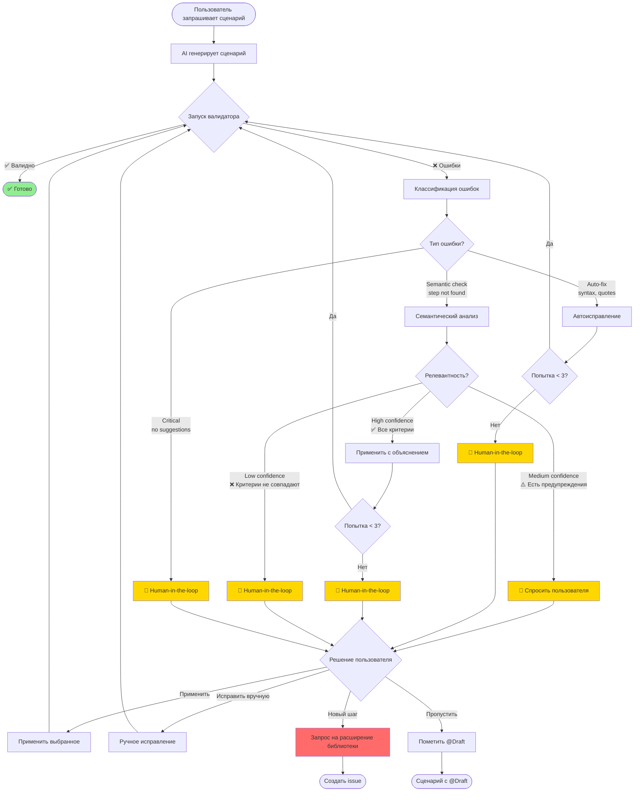
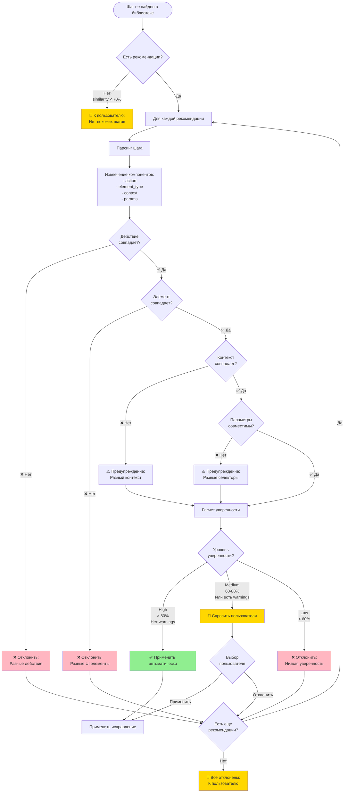
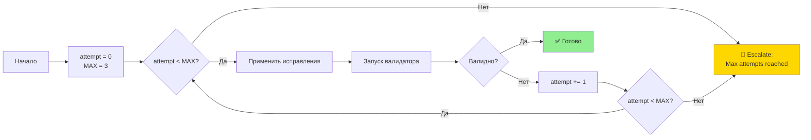
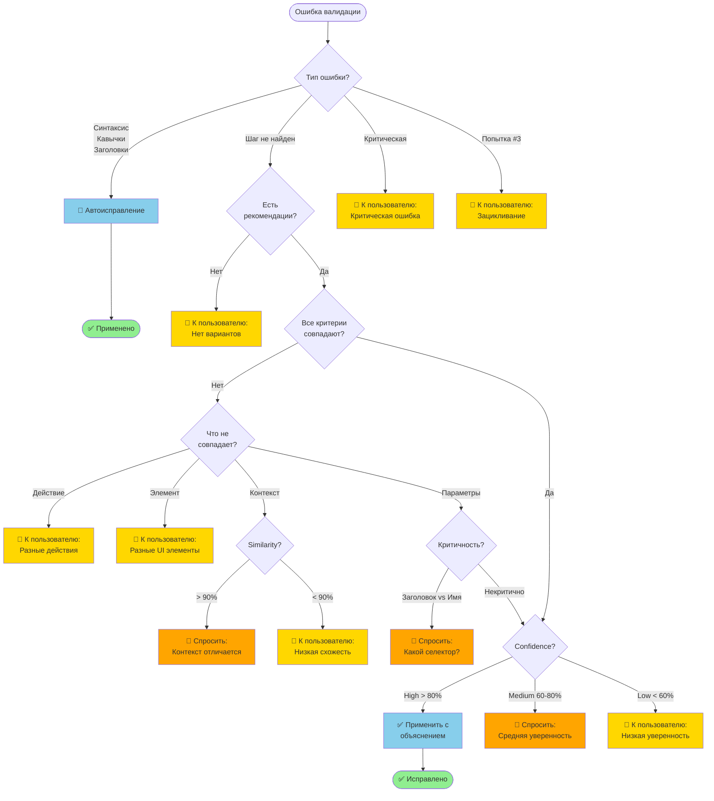
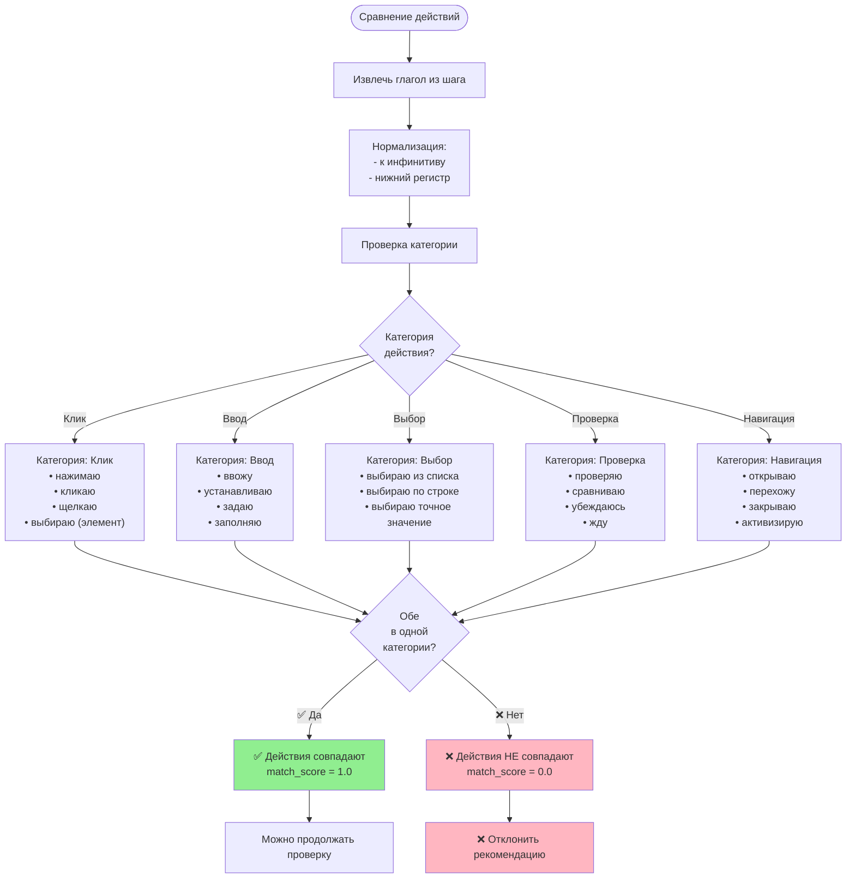
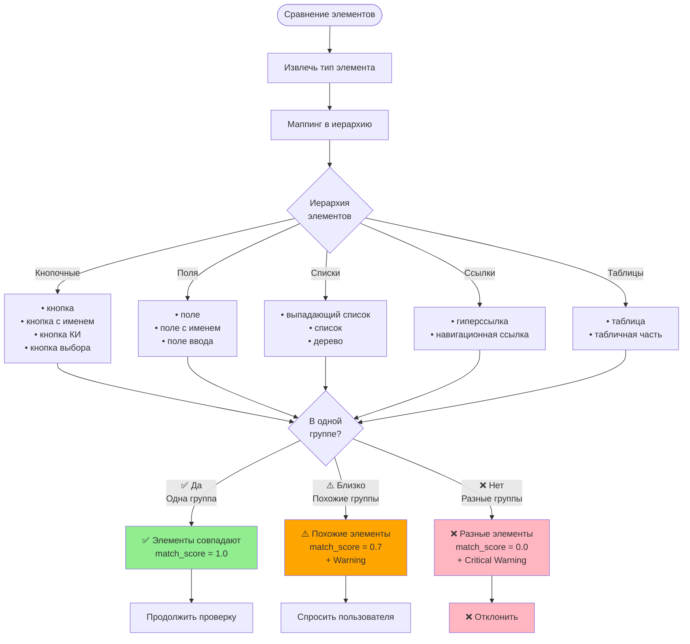
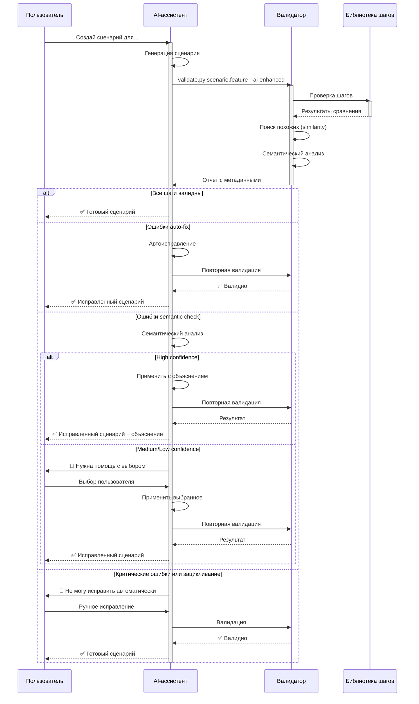
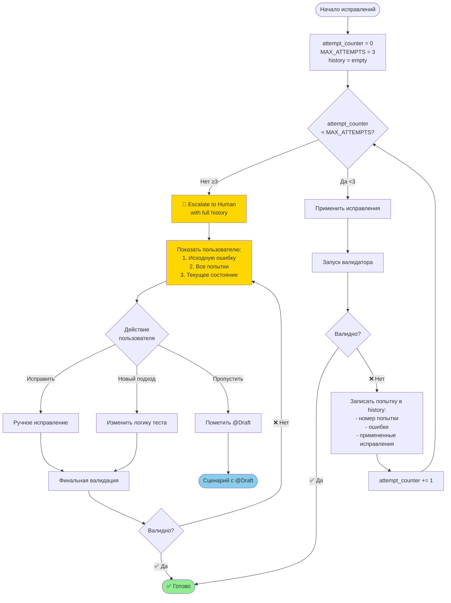
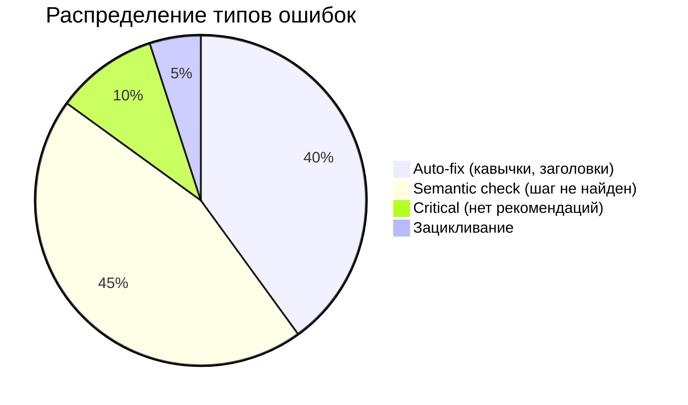
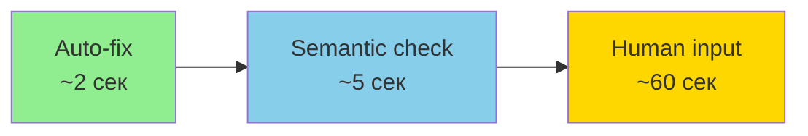

# Диаграммы workflow для AI-валидатора

> **Версия:** 1.0  
> **Дата:** 2025-11-28

---

## 🔄 Общий workflow с human-in-the-loop



---

## 🧠 Детальный процесс семантической проверки



---

## 🛡️ Защита от зацикливания



---

## 📊 Дерево принятия решений



---

## 🔍 Процесс сравнения действий



---

## 🎯 Процесс сравнения UI элементов



---

## ⚡ Последовательность взаимодействия (Sequence Diagram)



---

## 📈 Flowchart счетчика попыток



---

## 🎨 Легенда для диаграмм

### Цветовая кодировка

```
🟢 Зеленый (#90EE90)  - Успешное завершение
🟡 Желтый (#FFD700)   - Требуется участие пользователя
🟠 Оранжевый (#FFA500) - Предупреждение, нужно внимание
🔴 Розовый (#FFB6C1)   - Отклонено, ошибка
🔵 Голубой (#87CEEB)  - Автоматическое действие AI
```

### Символы действий

```
🤖 - Автоматическое действие AI
🤝 - Human-in-the-Loop (требуется пользователь)
✅ - Успех, одобрено
❌ - Отклонено, ошибка
⚠️ - Предупреждение
🔄 - Повтор, итерация
```

---

## 📊 Статистика и метрики

### Типичное распределение ошибок



### Время обработки по типам



---

## 🔗 Связанные документы

- [`ai-validator-integration.md`](ai-validator-integration.md) - Архитектура решения
- [`../ai-knowledge/semantic-validation-guide.md`](../ai-knowledge/semantic-validation-guide.md) - Правила проверки
- [`../templates/prompts/ai-validator-workflow.md`](../templates/prompts/ai-validator-workflow.md) - Промпты для AI
