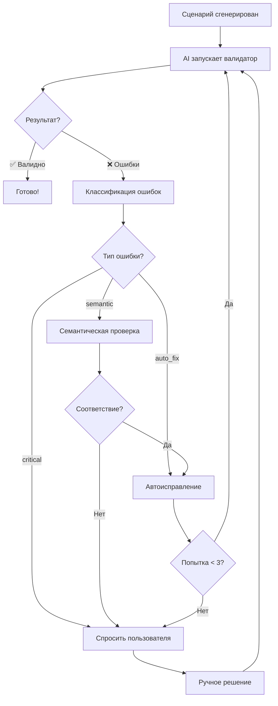

# Работа с AI-агентами в IDE: Пошаговое руководство

> **Для:** Kilo Code, Cursor, Continue, Windsurf и других AI-ассистентов в IDE  
> **Версия:** 1.0  
> **Дата:** Ноябрь 2025

---

## 🎯 Концепция

Этот документ описывает оптимальный рабочий процесс для создания и поддержки сценариев автоматизированного тестирования Vanessa Automation при работе с AI-агентом непосредственно в IDE/редакторе кода.

**Ключевые преимущества работы в IDE:**
- ✅ Файлы проекта уже в контексте - не нужно загружать вручную
- ✅ Прямое редактирование файлов - AI работает с реальной структурой проекта
- ✅ Интеграция с Git - версионирование изменений
- ✅ Запуск инструментов (валидатор) прямо из IDE
- ✅ Поддержка многофайловых операций

---

## 📊 Три стратегии работы

### Сравнительная таблица

| Критерий | 🟢 Экономная | 🟡 Рекомендуемая | 🔵 Расширенная |
|----------|-------------|------------------|----------------|
| **Токены контекста** | ~50-100K | ~150-200K | ~250-300K |
| **Файлы в контексте** | `steps-library.json` | `steps-library.json`<br>`guide.md` | `steps-library.json`<br>`guide.md`<br>`templates.md`<br>`semantic-validation-guide.md` |
| **Точность AI** | 75-80% | 90-95% | 95-98% |
| **Подходит для** | Простые сценарии<br>Опытные пользователи | Большинство задач<br>Смешанный уровень | Сложные сценарии<br>Обучение новичков |
| **Стоимость** | Минимальная | Средняя | Высокая |
| **Время генерации** | Быстро | Средне | Медленнее |
| **Потребность в правках** | Высокая (~30%) | Средняя (~10%) | Низкая (~5%) |

---

## 🚀 Развертывание проекта с нуля

### Шаг 1: Клонирование репозитория va-ai

```bash
# Клонируйте репозиторий в удобное место
git clone https://github.com/Nikolay-Shirokov/va-ai.git
cd va-ai
```

### Шаг 2: Создание проекта автотестов

Создайте отдельный проект для ваших тестовых сценариев:

```bash
# Вариант 1: Рядом с va-ai (рекомендуется)
cd ..
mkdir my-1c-autotests
cd my-1c-autotests

# Инициализация Git
git init
```

**Рекомендуемая структура проекта:**

```
my-1c-autotests/
├── .va-ai/                              # Конфигурация va-ai
│   ├── knowledge/                       # Копия или симлинк на ai-knowledge/
│   │   ├── guide.md                     # Руководство для AI
│   │   ├── steps-library.json           # База шагов
│   │   ├── templates.md                 # Шаблоны (опционально)
│   │   └── semantic-validation-guide.md # Правила валидации (опционально)
│   └── prompts/                         # Ваши промпты
│       ├── starter.md                   # Стартовый промпт
│       └── custom-prompts.md            # Дополнительные промпты
│
├── features/                            # Сценарии тестирования
│   ├── 00_Подготовка/                   # Начальная подготовка
│   │   ├── 01_Авторизация.feature
│   │   └── 02_НастройкаСреды.feature
│   │
│   ├── 10_Справочники/                  # Тесты справочников
│   │   ├── 01_Контрагенты/
│   │   │   ├── 01_СозданиеКонтрагента.feature
│   │   │   ├── 02_РедактированиеКонтрагента.feature
│   │   │   └── 03_УдалениеКонтрагента.feature
│   │   └── 02_Номенклатура/
│   │       └── 01_СозданиеНоменклатуры.feature
│   │
│   ├── 20_Документы/                    # Тесты документов
│   │   ├── 01_Продажи/
│   │   │   ├── 01_ЗаказПокупателя.feature
│   │   │   └── 02_РеализацияТоваров.feature
│   │   └── 02_Закупки/
│   │       └── 01_ПоступлениеТоваров.feature
│   │
│   ├── 30_Отчеты/                       # Тесты отчетов
│   │   └── 01_ОстаткиТоваров.feature
│   │
│   ├── 40_БизнесПроцессы/              # Комплексные сценарии
│   │   └── 01_ПолныйЦиклПродажи.feature
│   │
│   └── 90_Завершение/                   # Очистка данных
│       └── 01_ОчисткаТестовыхДанных.feature
│
├── docs/                                # Документация проекта
│   ├── test-plan.md                     # План тестирования
│   └── conventions.md                   # Соглашения команды
│
├── .gitignore
└── README.md
```

### Шаг 3: Связывание с va-ai (база знаний)

**Вариант A: Символическая ссылка (Linux/Mac/Windows 10+)**
```bash
# Из корня вашего проекта
mkdir -p .va-ai/knowledge
ln -s ../../va-ai/ai-knowledge/* .va-ai/knowledge/
```

**Вариант B: Копирование файлов**
```bash
mkdir -p .va-ai/knowledge
cp ../va-ai/ai-knowledge/steps-library.json .va-ai/knowledge/
cp ../va-ai/ai-knowledge/guide.md .va-ai/knowledge/

# Опционально (для расширенной стратегии)
cp ../va-ai/ai-knowledge/templates.md .va-ai/knowledge/
cp ../va-ai/ai-knowledge/semantic-validation-guide.md .va-ai/knowledge/
```

**Вариант C: Git Submodule (для продвинутых)**
```bash
git submodule add https://github.com/Nikolay-Shirokov/va-ai.git .va-ai/va-ai-repo
ln -s .va-ai/va-ai-repo/ai-knowledge .va-ai/knowledge
```

### Шаг 4: Создание .gitignore

```gitignore
# IDE
.vscode/
.idea/
*.swp

# OS
.DS_Store
Thumbs.db

# Temporary files
*.tmp
*.bak

# Logs
*.log

# Local settings
.env
local-settings.json
```

### Шаг 5: Создание базовой документации

**README.md:**
```markdown
# Автотесты для [Название проекта]

Сценарии автоматизированного тестирования на базе Vanessa Automation.

## Структура

- `features/` - тестовые сценарии
- `.va-ai/` - база знаний для AI-ассистента

## Запуск тестов

[Инструкции по запуску]

## Разработка с AI

См. [docs/ai-workflow.md](docs/ai-workflow.md)
```

---

## 💬 Работа с AI-агентом: Пошаговый процесс

### Этап 1: Инициализация сессии

#### 🟢 Экономная стратегия

**Промпт для первого запуска:**
```markdown
Ты - эксперт по Vanessa Automation для тестирования 1С:Предприятие.

КОНТЕКСТ:
- В проекте есть `.va-ai/knowledge/steps-library.json` - база из 1569 шагов
- Ты должен использовать ТОЛЬКО шаги из этой библиотеки

КРИТИЧЕСКИ ВАЖНО:
1. Не придумывай новые шаги - используй только из steps-library.json
2. Всегда используй двойные кавычки ""
3. Обязательные заголовки:
   # encoding: utf-8
   # language: ru
4. Структура: Функционал → Сценарий → Шаги (Дано/Когда/Тогда)

WORKFLOW:
1. Генерирую сценарий по описанию пользователя
2. Автоматически проверяю через валидатор:
   python ../va-ai/tools/validator/validate.py <файл> --ai-enhanced
3. Исправляю ошибки по рекомендациям валидатора
4. Повторяю пока сценарий не станет валидным

Готов помогать!
```

**Команда для чтения библиотеки:**
```
Kilo Code, прочитай файл `.va-ai/knowledge/steps-library.json` 
для понимания доступных шагов Vanessa Automation.
```

#### 🟡 Рекомендуемая стратегия (оптимальная)

**Промпт для первого запуска:**
```markdown
Ты - эксперт по Vanessa Automation для тестирования 1С:Предприятие.

БАЗА ЗНАНИЙ:
- `.va-ai/knowledge/steps-library.json` - 1569 доступных шагов
- `.va-ai/knowledge/guide.md` - полное руководство по синтаксису и best practices

КРИТИЧЕСКИ ВАЖНО:
1. Используй ТОЛЬКО шаги из steps-library.json - не выдумывай новые
2. Следуй синтаксису и рекомендациям из guide.md
3. Всегда используй двойные кавычки ""
4. Структурируй сценарии: Given → When → Then

WORKFLOW С ВАЛИДАЦИЕЙ:
1. Анализирую требование пользователя
2. Генерирую сценарий, используя шаги из библиотеки
3. Автоматически запускаю валидатор:
   python ../va-ai/tools/validator/validate.py <файл> --ai-enhanced
4. Анализирую отчет валидатора:
   - auto_fix (кавычки, заголовки) → исправляю автоматически
   - semantic_check_required → проверяю семантику, применяю с уверенностью >80%
   - critical или low confidence → спрашиваю пользователя
5. Повторяю максимум 3 раза, затем обращаюсь к пользователю

ЗАЩИТА ОТ ОШИБОК:
- Проверяю каждую рекомендацию валидатора на семантическое соответствие
- Не заменяю "кнопку" на "гиперссылку", "ввожу" на "выбираю" без подтверждения
- Веду счетчик попыток исправления (макс 3)

Готов к работе!
```

**Команда для загрузки контекста:**
```
Kilo Code, прочитай файлы:
1. `.va-ai/knowledge/steps-library.json`
2. `.va-ai/knowledge/guide.md`

Это база знаний для генерации сценариев Vanessa Automation.
```

#### 🔵 Расширенная стратегия

**Промпт для первого запуска:**
```markdown
Ты - эксперт по Vanessa Automation для тестирования 1С:Предприятие.

ПОЛНАЯ БАЗА ЗНАНИЙ:
- `.va-ai/knowledge/steps-library.json` - 1569 доступных шагов с примерами
- `.va-ai/knowledge/guide.md` - синтаксис, best practices, типичные ошибки
- `.va-ai/knowledge/templates.md` - готовые шаблоны для типовых сценариев
- `.va-ai/knowledge/semantic-validation-guide.md` - правила проверки рекомендаций

ТВОИ ВОЗМОЖНОСТИ:
1. **Генерация**: Создаю сценарии любой сложности из описания
2. **Валидация**: Автоматически проверяю через валидатор
3. **Исправление**: Умная коррекция с семантической проверкой
4. **Оптимизация**: Применяю best practices из guide.md
5. **Шаблонизация**: Использую готовые шаблоны из templates.md

АЛГОРИТМ РАБОТЫ:
1. Анализирую требование пользователя
2. Выбираю подходящий шаблон (если есть)
3. Генерирую сценарий, используя ТОЛЬКО шаги из библиотеки
4. Запускаю валидатор: python ../va-ai/tools/validator/validate.py <файл> --ai-enhanced
5. Обрабатываю результат:
   • auto_fix → применяю без вопросов
   • semantic_check_required → проверяю по semantic-validation-guide.md
     - Сверяю: действие, элемент, контекст, параметры
     - Применяю только при confidence > 80% И semantic match
   • critical / low confidence → спрашиваю с подробным объяснением
6. Защита от зацикливания: макс 3 попытки → к пользователю с историей

СЕМАНТИЧЕСКАЯ ПРОВЕРКА (обязательно!):
- Сравниваю действия: "нажимаю" должен остаться "нажимаю"
- Сравниваю элементы: "кнопка" НЕ РАВНО "гиперссылка"
- Сравниваю контекст: "в таблице" vs "в форме"
- НЕ применяю рекомендацию при расхождениях!

КАЧЕСТВО:
- Использую best practices из guide.md
- Применяю правильную структуру из templates.md
- Избегаю типичных ошибок (описаны в guide.md раздел 9)
- Добавляю проверки результата (минимум одна Тогда-проверка)

Готов к работе на максимальном уровне качества!
```

**Команда для загрузки полного контекста:**
```
Kilo Code, прочитай все файлы базы знаний для работы с Vanessa Automation:
1. `.va-ai/knowledge/steps-library.json` - библиотека шагов
2. `.va-ai/knowledge/guide.md` - руководство
3. `.va-ai/knowledge/templates.md` - шаблоны
4. `.va-ai/knowledge/semantic-validation-guide.md` - правила валидации

Это полная база для генерации высококачественных сценариев.
```

---

### Этап 2: Создание нового сценария

#### Уровень 1: Минимальное описание (быстро, но AI может додумывать)

```
Kilo Code, создай сценарий для создания контрагента типа "Покупатель".
```

**Плюсы:** Быстро  
**Минусы:** AI додумает детали, может не соответствовать вашей конфигурации  
**Подходит для:** Прототипирование, эксперименты

#### Уровень 2: Структурированное описание (рекомендуется)

```
Kilo Code, создай сценарий для создания контрагента:

КОНТЕКСТ:
- Справочник: Контрагенты
- Тип: Покупатель

ПОСЛЕДОВАТЕЛЬНОСТЬ:
1. Открыть список справочника Контрагенты
2. Нажать кнопку "Создать"
3. Заполнить поле "Наименование" значением "ООО Рога и копыта"
4. Заполнить поле "ИНН" значением "1234567890"
5. Нажать "Записать и закрыть"

ПРОВЕРКА:
- Контрагент должен появиться в списке
- Реквизиты должны быть заполнены корректно

ФАЙЛ: features/10_Справочники/01_Контрагенты/01_СозданиеКонтрагента.feature
```

**Плюсы:** Точный результат, минимум правок  
**Минусы:** Требует времени на описание  
**Подходит для:** Продакшен-сценарии, регрессионное тестирование

#### Уровень 3: Детальное описание с UI-элементами (максимальная точность)

```
Kilo Code, создай сценарий для создания контрагента:

КОНТЕКСТ:
- Справочник: Справочник.Контрагенты
- Навигационная ссылка: e1cib/list/Справочник.Контрагенты

ДЕЙСТВИЯ:
1. Открыть форму списка по навигационной ссылке
2. Нажать кнопку с именем "FormCreate"
3. Дождаться открытия окна "Контрагент (создание)"
4. В поле "Наименование" ввести "ООО Рога и копыта"
5. Из выпадающего списка "ВидКонтрагента" выбрать "Покупатель"
6. В поле "ИНН" ввести "1234567890"
7. Нажать кнопку с именем "FormWriteAndClose"

ПРОВЕРКИ:
- Окно должно закрыться
- В форме списка должна появиться строка с "ООО Рога и копыта"
- Реквизит "ВидКонтрагента" должен быть "Покупатель"

ДОПОЛНИТЕЛЬНО:
- Тег сценария: @Справочники @Smoke
- Запомнить ссылку на созданный объект в переменную "НовыйКонтрагент"

ПУТЬ: features/10_Справочники/01_Контрагенты/01_СозданиеКонтрагента.feature
```

**Плюсы:** Идеальное соответствие требованиям, готово к запуску  
**Минусы:** Требует детального знания UI  
**Подходит для:** Критичные сценарии, CI/CD pipeline

---

### Этап 3: Автоматическая валидация и исправление

AI-агент автоматически выполняет этот цикл после генерации:



**Что видит пользователь:**

```
✅ Kilo Code ответ:

Создан сценарий `features/10_Справочники/01_Контрагенты/01_СозданиеКонтрагента.feature`

Результаты валидации:
📊 Попытка 1: Найдены ошибки с кавычками ('), автоматически исправлено на (")
📊 Попытка 2: ✅ Валидация пройдена успешно!

Сценарий готов к запуску.
```

**Или, если требуется уточнение:**

```
⚠️ Kilo Code запрос:

Строка 12: И я нажимаю кнопку "Выбрать"

Валидатор предлагает два варианта:
1. И я нажимаю на кнопку "Выбрать" (similarity: 95%)
2. И я нажимаю на гиперссылку "Выбрать" (similarity: 88%)

❓ Вопрос: Элемент "Выбрать" в вашей форме - это кнопка или гиперссылка?
```

---

### Этап 4: Типовые задачи

#### Задача 1: Исправление существующего сценария

```
Kilo Code, в файле `features/20_Документы/01_Продажи/01_ЗаказПокупателя.feature`
нужно изменить проверку суммы документа с 1000 на 1500.
```

AI:
1. Читает файл
2. Находит строку с проверкой суммы
3. Вносит изменение
4. Запускает валидатор
5. Подтверждает успешность

#### Задача 2: Добавление новой проверки

```
Kilo Code, добавь в конец сценария `01_СозданиеКонтрагента.feature`
проверку, что у контрагента заполнено поле "ДатаСоздания".
```

AI:
1. Читает файл
2. Находит подходящий шаг проверки из библиотеки
3. Добавляет в конец сценария
4. Валидирует
5. Сохраняет

#### Задача 3: Рефакторинг с использованием переменных

```
Kilo Code, в файле `02_РеализацияТоваров.feature` контрагент "ООО Рога и копыта"
используется 3 раза. Вынеси его в переменную.
```

AI:
1. Читает файл
2. Находит все вхождения "ООО Рога и копыта"
3. Добавляет шаг определения переменной в начало
4. Заменяет все вхождения на "$Контрагент$"
5. Валидирует изменения

#### Задача 4: Создание серии связанных сценариев

```
Kilo Code, создай полный цикл работы с заказом покупателя:
1. Создание заказа
2. Изменение заказа
3. Проведение заказа
4. Отмена проведения
5. Удаление заказа

Каждый сценарий в отдельном файле в `features/20_Документы/01_Продажи/`.
```

AI создаст:
- `01_СозданиеЗаказа.feature`
- `02_ИзменениеЗаказа.feature`
- `03_ПроведениеЗаказа.feature`
- `04_ОтменаПроведения.feature`
- `05_УдалениеЗаказа.feature`

---

### Этап 5: Работа с ошибками при запуске

Если сценарий не проходит при запуске в Vanessa Automation:

#### Сценарий A: Ошибка выполнения шага

```
Kilo Code, при запуске сценария `01_СозданиеКонтрагента.feature` 
получил ошибку:

"Не найден элемент формы с именем 'FormCreate'"

Исправь, пожалуйста.
```

AI:
1. Читает сценарий
2. Находит проблемный шаг
3. Предлагает альтернативы:
   - По заголовку кнопки вместо имени
   - Другой способ открытия формы создания

#### Сценарий B: Несоответствие данных

```
Kilo Code, сценарий выполняется, но проверка падает:
Ожидалось: "Проведен" = "Да"
Получено: "Проведен" = "Нет"

Похоже, забыли нажать "Провести" перед проверкой.
```

AI:
1. Анализирует сценарий
2. Находит место перед проверкой
3. Добавляет шаг проведения
4. Валидирует

---

## 🛠️ Настройка рабочего пространства

### Рекомендуемые настройки VS Code

**`.vscode/settings.json`:**
```json
{
  "files.encoding": "utf8",
  "files.eol": "\n",
  "files.associations": {
    "*.feature": "gherkin"
  },
  "editor.tabSize": 2,
  "editor.rulers": [80],
  "gherkin.format.width": 80
}
```

### Расширения VS Code

- **Cucumber (Gherkin) Full Support** - подсветка синтаксиса .feature файлов
- **Kilo Code** - AI-ассистент
- **GitLens** - работа с Git

### Настройка Kilo Code для проекта

Создайте `.kilo-code/config.json` (если поддерживается):
```json
{
  "project": "1C Autotests",
  "context_files": [
    ".va-ai/knowledge/steps-library.json",
    ".va-ai/knowledge/guide.md"
  ],
  "validation_command": "python ../va-ai/tools/validator/validate.py {file} --ai-enhanced",
  "auto_validate": true
}
```

---

## 📈 Метрики и улучшение

### Отслеживание эффективности

**Ведите журнал:**
```markdown
# Журнал работы с AI

## 2025-11-28
- Создано сценариев: 5
- Исправлений после валидации: 2 (40%)
- Запросов к пользователю: 1
- Время на разработку: 1.5 часа (экономия ~70% vs ручная разработка)
- Стратегия: Рекомендуемая

## Выводы
- Уменьшить абстрактность в промптах
- Чаще указывать имена UI элементов
```

### KPI для оценки

| Метрика | Целевое значение |
|---------|------------------|
| Сценариев с 1-й попытки валидных | > 80% |
| Среднее время создания сценария | < 10 мин |
| Сценариев, упавших при запуске | < 10% |
| Необходимость ручных правок | < 20% |

---

## 🎓 Best Practices

### DO ✅

1. **Давайте контекст**: Чем больше деталей, тем точнее результат
2. **Проверяйте до коммита**: Валидатор + пробный запуск
3. **Используйте переменные**: Для повторяющихся значений
4. **Структурируйте проект**: Понятные каталоги и имена
5. **Версионируйте**: Git + осмысленные commit message
6. **Итерируйте**: Начните с простого, усложняйте постепенно
7. **Обучайте AI**: Показывайте успешные примеры

### DON'T ❌

1. **Не доверяйте слепо**: AI может ошибаться
2. **Не пропускайте валидацию**: Даже если "выглядит правильно"
3. **Не игнорируйте warnings**: Они предупреждают о проблемах
4. **Не усложняйте без нужды**: Простота = надежность
5. **Не смешивайте подходы**: Формы отдельно, движения отдельно
6. **Не создавайте монолиты**: Разбивайте на маленькие сценарии

---

## 🆘 Решение проблем

### AI не понимает задачу

**Проблема:** Генерирует неправильный сценарий

**Решение:**
1. Уточните задачу более детально
2. Дайте пример похожего сценария
3. Укажите конкретные шаги из библиотеки
4. Переформулируйте запрос

### AI зацикливается на исправлениях

**Проблема:** 3+ попытки, сценарий все еще невалиден

**Решение:**
1. Остановите процесс
2. Проверьте, корректна ли задача
3. Возможно, нужного шага нет в библиотеке
4. Упростите сценарий
5. Обратитесь к документации Vanessa Automation

### Валидация проходит, но сценарий не выполняется

**Проблема:** Синтаксис правильный, но логика неверная

**Решение:**
1. Проверьте имена элементов формы (могут отличаться)
2. Убедитесь, что последовательность действий корректна
3. Добавьте ожидания (`И пауза N секунд`)
4. Проверьте навигационные ссылки

---

## 📚 Дополнительные ресурсы

- [Project Structure Guide](project-structure-guide.md) - Детальное руководство по организации проекта
- [Kilo Code Prompts Library](../templates/prompts/kilo-code-prompts.md) - Библиотека готовых промптов
- [Kilo Code Cheat Sheet](kilo-code-cheat-sheet.md) - Краткая шпаргалка
- [Vanessa Automation Docs](https://pr-mex.github.io/vanessa-automation/dev/) - Официальная документация

---

**Версия:** 1.0  
**Дата обновления:** Ноябрь 2025  
**Авторы:** va-ai project team