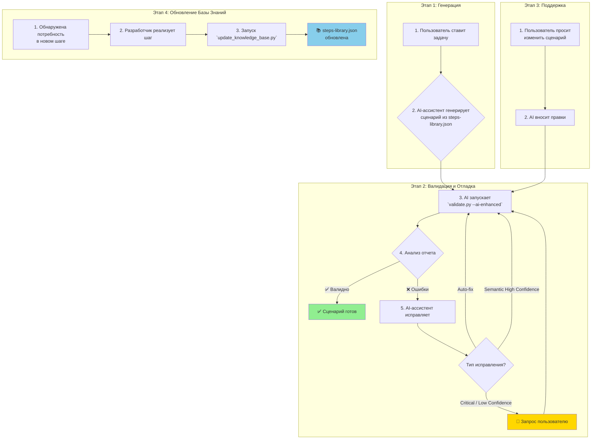

# Workflow: Жизненный цикл разработки и поддержки Gherkin-сценариев с AI-ассистентом

> **Версия:** 1.0  
> **Статус:** Проектирование

---

## 🎯 Концепция: AI-Assisted, Human-in-the-Loop

Этот документ описывает стандартный рабочий процесс (workflow) для создания, валидации и поддержки `.feature` файлов с использованием AI-ассистента (Kilo Code), интегрированного с инструментами проекта, в частности с AI-валидатором.

**Ключевые принципы:**
- **AI как ассистент, а не автопилот:** AI выполняет рутинные и сложные задачи, но финальное решение всегда остается за разработчиком (Human-in-the-Loop).
- **Структурированные данные вместо догадок:** Мы используем детерминированные инструменты (`validate.py`) для анализа и предоставляем AI готовые структурированные данные, минимизируя вероятность ошибки.
- **TDD (Test-Driven Development) подход:** Сначала пишется сценарий, который описывает ожидаемое поведение, а затем он используется для проверки и отладки.

---

## 📊 Визуальная диаграмма Workflow



---

## 🔄 Этапы жизненного цикла

### Этап 1: Генерация нового сценария (TDD)

1.  **Постановка задачи (Пользователь):**
    - Пользователь дает команду AI-ассистенту в свободной форме.
    - *Пример: "Kilo Code, напиши, пожалуйста, сценарий для проверки входа в систему с неверным паролем."*

2.  **Генерация "скелета" (AI-ассистент):**
    - AI-ассистент обращается к файлу `ai-knowledge/steps-library.json` для подбора релевантных шагов.
    - Он генерирует `.feature` файл, используя только существующие шаги. Это минимизирует количество ошибок "шаг не найден".
    - AI добавляет обязательные заголовки (`# encoding: utf-8`, `# language: ru`) и структуру (`Функционал`, `Сценарий`).

### Этап 2: Валидация и AI-Assisted Debugging

1.  **Запуск валидатора (AI-ассистент):**
    - Сразу после генерации файла, AI автоматически выполняет команду:
      ```bash
      python tools/validator/validate.py <имя_файла>.feature --ai-enhanced
      ```

2.  **Анализ отчета (AI-ассистент):**
    - AI получает структурированный YAML-отчет. Ему не нужно парсить текст — он работает с готовыми данными.

3.  **Принятие решений об исправлении (AI-ассистент):**
    - **Если `errors` пустой:** Процесс завершен. Сценарий готов.
    - **Если есть ошибки с `severity: auto_fix`:** AI применяет исправления (например, замена кавычек) и **возвращается к шагу 1** (повторная валидация).
    - **Если есть ошибки с `severity: semantic_check_required`:**
        - AI анализирует массив `suggestions`.
        - Он находит рекомендацию с `confidence: high` и `is_safe: true`.
        - Если такая найдена, AI применяет ее, пишет в чат объяснение и **возвращается к шагу 1**.
    - **Если есть ошибки `severity: critical` или у всех рекомендаций `confidence: low`:**
        - AI **не пытается угадать**.
        - Он формирует запрос пользователю, используя данные из отчета: ошибочный шаг, лучшие 2-3 рекомендации и предупреждения (`warnings`).
        - *Пример запроса: "Обнаружена ошибка ... Валидатор предлагает заменить 'кнопку' на 'гиперссылку'. Это разные элементы. Какое действие корректно в вашем случае?"*
        - После ответа пользователя AI вносит правку и **возвращается к шагу 1**.

4.  **Защита от зацикливания:** AI-ассистент имеет встроенный счетчик (максимум 3 итерации авто-исправлений). Если после 3 попыток сценарий все еще не валиден, он принудительно обращается к пользователю с полной историей попыток.

### Этап 3: Поддержка и рефакторинг существующих сценариев

1.  **Постановка задачи (Пользователь):**
    - Пользователь просит изменить или дополнить существующий `.feature` файл.
    - *Пример: "Kilo Code, добавь в `05_СохранениеИЗагрузка.feature` проверку на то, что файл не пустой."*

2.  **Внесение изменений (AI-ассистент):**
    - AI-ассистент вносит требуемые изменения в код.
    - Сразу после этого он **переходит к Этапу 2**, запуская валидатор для проверки внесенных правок.

### Этап 4: Обновление базы знаний (Knowledge Base)

Этот процесс выполняется, когда для автоматизации новой функциональности не хватает существующих шагов.

1.  **Обнаружение потребности:** В ходе Этапа 2 выясняется, что ни один из существующих шагов не подходит (ошибка `critical` без релевантных `suggestions`).

2.  **Реализация нового шага (Разработчик):**
    - Разработчик пишет код нового шага в конфигурации 1С.

3.  **Обновление библиотеки (Разработчик/CI/CD):**
    - После добавления нового шага запускается скрипт:
      ```bash
      python tools/update_knowledge_base/update_knowledge_base.py
      ```
    - Этот скрипт извлекает новые шаги из 1С и обновляет `ai-knowledge/steps-library.json`.

4.  **Продолжение работы:** AI-ассистент теперь может использовать новый шаг для завершения сценария, вернувшись к Этапу 2.

---

## 👥 Роли и ответственности

-   **Пользователь (Разработчик/QA):**
    - Ставит бизнес-задачи.
    - Принимает финальные решения в сложных случаях (`Human-in-the-Loop`).
    - Реализует новые шаги в 1С, если это необходимо.

-   **AI-ассистент (Kilo Code):**
    - Генерирует и изменяет `.feature` файлы.
    - Автоматически запускает валидатор.
    - Анализирует структурированные отчеты.
    - Самостоятельно исправляет очевидные и безопасные ошибки.
    - Эскалирует сложные проблемы на пользователя, предоставляя полный контекст.
    - Управляет циклом "код -> валидация -> исправление".

---

## 📝 Рекомендации по составлению первого промпта

Качество сгенерированного сценария напрямую зависит от качества первоначального запроса. Чтобы AI-ассистент с первого раза создал максимально релевантный код, предоставьте ему достаточный контекст.

### Уровень 1: Обязательный минимум (Must-have)

Это базовая информация, без которой генерация будет похожа на "гадание".

-   **🎯 Цель сценария:** Что проверяем? Каков ожидаемый бизнес-результат?
    -   *Плохо:* "Сделай тест для документа."
    -   *Хорошо:* "Напиши сценарий для проверки создания документа 'Заказ клиента' и его проведения."
-   **Ключевые сущности:** Какие объекты, документы или справочники задействованы?
    -   *Пример:* "Контрагент 'Рога и Копыта'", "Номенклатура 'Товар 1'".

### Уровень 2: Желательный контекст (Should-have)

Эта информация значительно повысит точность генерации.

-   **Последовательность действий (User Story):** Краткое описание шагов, которые выполняет пользователь.
    -   *Пример:* "Пользователь открывает список заказов, нажимает 'Создать', заполняет контрагента и товар, нажимает 'Провести'."
-   **Конкретные данные:** Значения, которые должны быть в полях или таблицах.
    -   *Пример:* "В поле 'Сумма' должно быть значение '1000'."

### Уровень 3: Идеальный контекст (Could-have)

Этот уровень контекста позволяет AI сгенерировать практически готовый к исполнению сценарий.

-   **UI-элементы:** Названия конкретных кнопок, полей, таблиц, если они известны.
    -   *Пример:* "Нажать кнопку 'Записать и закрыть', проверить, что в таблице 'Товары' появилась новая строка."
-   **Ожидаемый результат:** Что должно произойти в конце? Какое сообщение должно появиться? Какое состояние должна принять система?
    -   *Пример:* "В конце должно появиться сообщение 'Документ проведен успешно', а у документа установиться статус 'Проведен'."

### Пример идеального промпта

```
Kilo Code, привет!

Давай напишем Gherkin-сценарий для проверки создания и проведения документа "Заказ клиента".

**Последовательность действий:**
1.  Открываем список документов "Заказ клиента".
2.  Нажимаем кнопку "Создать".
3.  В открывшейся форме в поле "Контрагент" выбираем "Рога и Копыта".
4.  В табличной части "Товары" добавляем новую строку.
5.  В колонке "Номенклатура" выбираем "Товар 1".
6.  В колонке "Количество" вводим "10".
7.  В колонке "Цена" вводим "150".
8.  Нажимаем кнопку "Провести и закрыть".

**Ожидаемый результат:**
- Должно появиться уведомление с текстом "Документ Заказ клиента... проведен".
- В списке документов "Заказ клиента" должна появиться новая строка с контрагентом "Рога и Копыта" и суммой "1500".
```