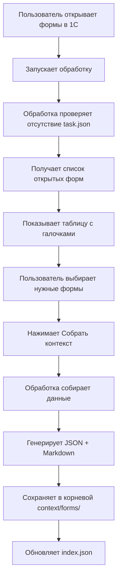
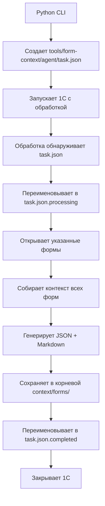

# Упрощенная архитектура Form Context Collector

> **Автономное решение без зависимости от Vanessa Automation**

---

## 🎯 Концепция

Полностью автономный инструмент для сбора контекста форм 1С с двумя режимами работы:

### Интерактивный режим
Пользователь вручную открывает нужные формы и выбирает их в обработке

### Агентский режим  
Python CLI автоматически запускает 1С, обработка собирает контекст и закрывается

---

## 📊 Архитектура

### Интерактивный режим



### Агентский режим



---

## 🔧 Компоненты

### 1. Обработка 1С (FormContextCollector.epf)

**Местоположение:** `tools/form-context/FormContextCollector.epf`

**Ключевые функции:**

#### Получение списка открытых форм

```bsl
&НаКлиенте
Функция ПолучитьСписокОткрытыхФорм()
    СписокФорм = Новый Массив;
    
    // Получаем все окна приложения
    ВсеОкна = ПолучитьОкна();
    
    Для Каждого Окно Из ВсеОкна Цикл
        // Получаем формы в окне
        МассивФорм = Окно.Содержимое;
        
        Для Каждого Форма Из МассивФорм Цикл
            ИнфоФормы = Новый Структура;
            ИнфоФормы.Вставить("Заголовок", Форма.Заголовок);
            ИнфоФормы.Вставить("ИмяФормы", ПолучитьПолноеИмяФормы(Форма));
            ИнфоФормы.Вставить("ТипФормы", ОпределитьТипФормы(Форма));
            ИнфоФормы.Вставить("СсылкаНаФорму", Форма);
            
            СписокФорм.Добавить(ИнфоФормы);
        КонецЦикла;
    КонецЦикла;
    
    Возврат СписокФорм;
КонецФункции
```

#### Определение пути сохранения

```bsl
&НаСервере
Функция ПолучитьПутьКонтекста()
    // Получаем путь к файлу обработки
    ПутьКОбработке = ЭтотОбъект.ИспользуемоеИмяФайла;
    
    // Извлекаем директорию
    ФайлОбработки = Новый Файл(ПутьКОбработке);
    КаталогОбработки = ФайлОбработки.Путь;
    
    // Поднимаемся на 2 уровня вверх до корня проекта
    // tools/form-context/ -> tools/ -> корень проекта
    КаталогTools = Новый Файл(КаталогОбработки).Путь;
    КорневойКаталог = Новый Файл(КаталогTools).Путь;
    
    // Формируем путь к context/forms/ в корне проекта
    ПутьКонтекста = КорневойКаталог + "context" + ПолучитьРазделительПути() + "forms" + ПолучитьРазделительПути();
    
    // Создаем директорию если не существует
    Файл = Новый Файл(ПутьКонтекста);
    Если Не Файл.Существует() Тогда
        СоздатьКаталог(ПутьКонтекста);
    КонецЕсли;
    
    Возврат ПутьКонтекста;
КонецФункции
```

#### Генерация имени файла

```bsl
&НаСервере
Функция СформироватьИмяФайла(ПолноеИмяФормы)
    // Пример: "Документ.ЗаказПокупателя.Форма.ФормаДокумента"
    // Или: "Справочник.Контрагенты.Форма.ФормаЭлемента"
    
    // Используем полное имя формы как есть
    ИмяФайла = СтрЗаменить(ПолноеИмяФормы, "/", ".");
    ИмяФайла = СтрЗаменить(ИмяФайла, "\", ".");
    
    Возврат ИмяФайла;
КонецФункции
```

#### Генерация Markdown

```bsl
&НаСервере
Функция СгенерироватьMarkdown(ДанныеФормы)
    Результат = "";
    
    // Заголовок
    Результат = Результат + "# Форма: " + ДанныеФормы.title + Символы.ПС + Символы.ПС;
    Результат = Результат + "**Полное имя:** `" + ДанныеФормы.form_name + "`" + Символы.ПС;
    Результат = Результат + "**Тип:** " + ДанныеФормы.form_type + Символы.ПС;
    Результат = Результат + "**Собрано:** " + Формат(ДанныеФормы.metadata.collected_at, "ДФ='dd.MM.yyyy HH:mm'") + Символы.ПС + Символы.ПС;
    Результат = Результат + "---" + Символы.ПС + Символы.ПС;
    
    // Группировка элементов по типам
    ПоляВвода = Новый Массив;
    Кнопки = Новый Массив;
    Таблицы = Новый Массив;
    
    Для Каждого Элемент Из ДанныеФормы.elements Цикл
        Если Элемент.type = "input_field" Тогда
            ПоляВвода.Добавить(Элемент);
        ИначеЕсли Элемент.type = "button" Тогда
            Кнопки.Добавить(Элемент);
        ИначеЕсли Элемент.type = "table" Тогда
            Таблицы.Добавить(Элемент);
        КонецЕсли;
    КонецЦикла;
    
    // Поля ввода
    Если ПоляВвода.Количество() > 0 Тогда
        Результат = Результат + "## 📝 Поля формы" + Символы.ПС + Символы.ПС;
        Для Каждого Поле Из ПоляВвода Цикл
            Результат = Результат + "- `" + Поле.name + "`";
            Если Не ПустаяСтрока(Поле.title) И Поле.title <> Поле.name Тогда
                Результат = Результат + " (""" + Поле.title + """)";
            КонецЕсли;
            Результат = Результат + Символы.ПС;
        КонецЦикла;
        Результат = Результат + Символы.ПС;
    КонецЕсли;
    
    // Таблицы
    Если Таблицы.Количество() > 0 Тогда
        Результат = Результат + "## 📊 Табличные части" + Символы.ПС + Символы.ПС;
        Для Каждого Таблица Из Таблицы Цикл
            Результат = Результат + "### " + Таблица.name;
            Если Не ПустаяСтрока(Таблица.title) Тогда
                Результат = Результат + " (""" + Таблица.title + """)";
            КонецЕсли;
            Результат = Результат + Символы.ПС + Символы.ПС;
            
            // Колонки таблицы будут в children
            Если Таблица.Свойство("children") Тогда
                Для Каждого Колонка Из Таблица.children Цикл
                    Результат = Результат + "- `" + Колонка.name + "`";
                    Если Не ПустаяСтрока(Колонка.title) Тогда
                        Результат = Результат + " (""" + Колонка.title + """)";
                    КонецЕсли;
                    Результат = Результат + Символы.ПС;
                КонецЦикла;
            КонецЕсли;
            Результат = Результат + Символы.ПС;
        КонецЦикла;
    КонецЕсли;
    
    // Кнопки
    Если Кнопки.Количество() > 0 Тогда
        Результат = Результат + "## 🔘 Команды" + Символы.ПС + Символы.ПС;
        Для Каждого Кнопка Из Кнопки Цикл
            Результат = Результат + "- `" + Кнопка.name + "`";
            Если Не ПустаяСтрока(Кнопка.title) Тогда
                Результат = Результат + " (""" + Кнопка.title + """)";
            КонецЕсли;
            Результат = Результат + Символы.ПС;
        КонецЦикла;
        Результат = Результат + Символы.ПС;
    КонецЕсли;
    
    // Статистика
    Результат = Результат + "---" + Символы.ПС + Символы.ПС;
    Результат = Результат + "**Всего элементов:** " + Формат(ДанныеФормы.elements.Количество(), "ЧГ=") + Символы.ПС;
    
    Возврат Результат;
КонецФункции
```

### 2. UI формы обработки

**Элементы формы:**

```
┌─────────────────────────────────────────────────────────┐
│ Form Context Collector                                  │
├─────────────────────────────────────────────────────────┤
│                                                          │
│ Режим работы: Интерактивный / Агентский (автоопределение)│
│                                                          │
│ [Обновить список форм]                                   │
│                                                          │
│ ┌──────────────────────────────────────────────────────┐│
│ │☑│ Заголовок           │ Вид объекта   │ Тип формы   ││
│ ├──────────────────────────────────────────────────────┤│
│ │☑│ Заказ покупателя    │ Документ      │ ФормаДокум..││
│ │☐│ Контрагент          │ Справочник    │ ФормаЭлеме..││
│ │☑│ Список заказов      │ Документ      │ ФормаСписк..││
│ │☐│ Остатки товаров     │ Отчет         │ ФормаОтчет..││
│ └──────────────────────────────────────────────────────┘│
│                                                          │
│ Настройки:                                               │
│ ☑ Включать невидимые элементы                            │
│ ☑ Генерировать Markdown                                  │
│ Путь: [корень проекта/context/forms/]      [Выбрать]    │
│                                                          │
│ [Собрать контекст]  [Очистить]                           │
│                                                          │
│ Статус: Готов к работе                                   │
│ ┌────────────────────────────────────────────────────┐  │
│ │ Результаты сбора:                                   │  │
│ │                                                     │  │
│ └────────────────────────────────────────────────────┘  │
└─────────────────────────────────────────────────────────┘
```

**Примечания к UI:**
- **"Вид объекта"** - Документ, Справочник, Отчет, Обработка и т.п.
- **"Тип формы"** - ФормаДокумента, ФормаСписка, ФормаЭлемента, ФормаОтчета, ПроизвольнаяФорма и т.п.
- Автоматическое определение режима по наличию `agent/task.json`

### 3. Структура данных

#### Управляющий файл (tools/form-context/agent/task.json)

**Жизненный цикл файла в агентском режиме:**
1. Python CLI создает `task.json`
2. Обработка обнаруживает файл и переименовывает в `task.json.processing`
3. После успешного завершения переименовывает в `task.json.completed`
4. При ошибке переименовывает в `task.json.error`

**Это предотвращает:**
- Повторную обработку того же задания
- Запуск агентского режима при ручном открытии обработки
- Конфликты при параллельном запуске

**Формат файла:**

```json
{
  "version": "1.0",
  "mode": "agent",
  "forms": [
    {
      "type": "navigation_link",
      "value": "e1cib/data/Документ.ЗаказПокупателя?ref=...",
      "form_name": "ФормаДокумента"
    },
    {
      "type": "metadata_object",
      "value": "Справочник.Контрагенты",
      "form_name": "ФормаЭлемента"
    },
    {
      "type": "form_path",
      "value": "Документ.ЗаказПокупателя.Форма.ФормаСписка"
    }
  ],
  "options": {
    "include_invisible": false,
    "generate_markdown": true,
    "max_depth": 5,
    "close_after_collection": true
  },
  "output": {
    "path": "context/forms/",
    "update_index": true
  }
}
```

#### Реестр форм (корень проекта/context/forms/index.json)

```json
{
  "version": "1.0",
  "updated_at": "2025-11-29T15:00:00Z",
  "forms": {
    "Документ.ЗаказПокупателя.Форма.ФормаДокумента": {
      "title": "Заказ покупателя",
      "type": "document_form",
      "json_path": "Документ.ЗаказПокупателя.Форма.ФормаДокумента.json",
      "markdown_path": "Документ.ЗаказПокупателя.Форма.ФормаДокумента.md",
      "collected_at": "2025-11-29T14:30:00Z",
      "element_count": 25,
      "detail_level": "minimal"
    },
    "Справочник.Контрагенты.Форма.ФормаЭлемента": {
      "title": "Контрагент",
      "type": "catalog_form",
      "json_path": "Справочник.Контрагенты.Форма.ФормаЭлемента.json",
      "markdown_path": "Справочник.Контрагенты.Форма.ФормаЭлемента.md",
      "collected_at": "2025-11-29T14:32:00Z",
      "element_count": 18,
      "detail_level": "minimal"
    }
  }
}
```

### 4. Python CLI (form_context_cli.py)

**Использование агентского режима:**

```bash
# Собрать контекст для конкретных форм
python tools/form-context/form_context_cli.py agent \
    --infobase "File=C:/Bases/Test/" \
    --forms "Документ.ЗаказПокупателя" "Справочник.Контрагенты"

# С навигационными ссылками
python tools/form-context/form_context_cli.py agent \
    --infobase "File=C:/Bases/Test/" \
    --links "e1cib/data/Документ.ЗаказПокупателя?ref=..."

# Из файла со списком форм
python tools/form-context/form_context_cli.py agent \
    --infobase "File=C:/Bases/Test/" \
    --forms-file forms_to_collect.txt
```

**Проверка режима запуска в обработке:**

```bsl
&НаКлиенте
Функция ПроверитьРежимЗапуска()
    // Определяем путь к управляющему файлу
    ПутьКОбработке = ПолучитьПутьКОбработкеНаСервере();
    ФайлОбработки = Новый Файл(ПутьКОбработке);
    КаталогОбработки = ФайлОбработки.Путь;
    
    ПутьКTaskJSON = КаталогОбработки + "agent" + ПолучитьРазделительПути() + "task.json";
    
    ФайлTask = Новый Файл(ПутьКTaskJSON);
    
    Если ФайлTask.Существует() Тогда
        // Агентский режим - переименовываем файл
        НовоеИмя = ПутьКTaskJSON + ".processing";
        ПереместитьФайл(ПутьКTaskJSON, НовоеИмя);
        Возврат "agent";
    Иначе
        // Интерактивный режим
        Возврат "interactive";
    КонецЕсли;
КонецФункции
```

**Базовая структура CLI:**

```python
#!/usr/bin/env python3
"""
Form Context Collector - CLI для агентского режима
"""

import json
import subprocess
import sys
from pathlib import Path

def create_task_file(forms, options):
    """Создает управляющий файл task.json"""
    task = {
        "version": "1.0",
        "mode": "agent",
        "forms": forms,
        "options": options
    }
    
    task_file = Path(__file__).parent / "agent" / "task.json"
    task_file.parent.mkdir(exist_ok=True)
    
    with open(task_file, 'w', encoding='utf-8') as f:
        json.dump(task, f, ensure_ascii=False, indent=2)
    
    return task_file

def launch_1c_with_processing(infobase, processing_path):
    """Запускает 1С с обработкой"""
    cmd = [
        "1cv8",
        "ENTERPRISE",
        f"/F{infobase}",
        f"/Execute{processing_path}",
        "/C", "agent_mode"  # Параметр для режима
    ]
    
    result = subprocess.run(cmd, capture_output=True, text=True)
    return result.returncode == 0

def main():
    import argparse
    
    parser = argparse.ArgumentParser(
        description="Form Context Collector - Agent Mode"
    )
    parser.add_argument("--infobase", required=True, help="Infobase connection string")
    parser.add_argument("--forms", nargs="+", help="List of forms to collect")
    parser.add_argument("--generate-markdown", action="store_true", default=True)
    
    args = parser.parse_args()
    
    # Формируем список форм
    forms = []
    for form in args.forms:
        forms.append({
            "type": "metadata_object",
            "value": form
        })
    
    # Создаем task.json
    options = {
        "generate_markdown": args.generate_markdown,
        "close_after_collection": True
    }
    
    task_file = create_task_file(forms, options)
    print(f"Created task file: {task_file}")
    
    # Запускаем 1С
    processing_path = Path(__file__).parent / "FormContextCollector.epf"
    success = launch_1c_with_processing(args.infobase, processing_path)
    
    if success:
        print("Context collection completed successfully")
        return 0
    else:
        print("Error during context collection", file=sys.stderr)
        return 1

if __name__ == "__main__":
    sys.exit(main())
```

---

## 🔄 Workflow

### Интерактивный режим

1. **Пользователь:**
   - Открывает нужные формы в 1С
   - Запускает обработку FormContextCollector.epf

2. **Обработка:**
   - Получает список открытых форм через `ПолучитьОкна()`
   - Показывает таблицу с галочками
   - Ждет выбора пользователя

3. **Пользователь:**
   - Отмечает нужные формы
   - Нажимает "Собрать контекст"

4. **Обработка:**
   - Для каждой отмеченной формы:
     - Собирает данные о форме и элементах
     - Генерирует JSON
     - Генерирует Markdown
     - Сохраняет в `context/forms/`
   - Обновляет `index.json`
   - Показывает результат

### Агентский режим

1. **Python CLI:**
   - Получает список форм или навигационных ссылок
   - Создает `agent/task.json`
   - Запускает 1С с параметром для обработки

2. **Обработка:**
   - Определяет режим работы (агентский)
   - Читает `agent/task.json`
   - Открывает указанные формы одну за другой
   - Для каждой формы собирает контекст
   - Сохраняет результаты
   - Закрывает 1С

---

## 🎯 Преимущества упрощенной архитектуры

### ✅ Автономность
- Не требует Vanessa Automation
- Работает в любой конфигурации 1С
- Минимум зависимостей

### ✅ Гибкость
- Два режима работы на выбор
- Интерактивный для разового сбора
- Агентский для автоматизации

### ✅ Простота
- Понятный UI
- Прямой результат в файлы
- Сразу готовый Markdown

### ✅ Расширяемость
- Легко добавить новые форматы
- Можно расширить управляющий файл
- Модульная архитектура

---

## 📁 Структура проекта

```
va-ai/                                # Корень проекта
├── context/                          # ← Результаты сбора (в .gitignore)
│   ├── forms/                        # JSON + Markdown файлы
│   │   ├── Документ.ЗаказПокупателя.Форма.ФормаДокумента.json
│   │   ├── Документ.ЗаказПокупателя.Форма.ФормаДокумента.md
│   │   └── index.json               # Реестр всех собранных форм
│   └── .gitkeep
├── tools/
│   └── form-context/
│       ├── FormContextCollector.epf  # Обработка 1С
│       ├── form_context_cli.py       # Python CLI
│       ├── README.md                 # Документация
│       ├── SIMPLIFIED_ARCHITECTURE.md # Этот документ
│       ├── agent/                    # Для агентского режима
│       │   ├── task.json             # Управляющий файл (создается CLI)
│       │   ├── task.json.processing  # Во время обработки
│       │   ├── task.json.completed   # После успеха
│       │   ├── task.json.error       # При ошибке
│       │   └── .gitkeep
│       └── src/                      # Исходники обработки
│           └── FormContextCollector/
└── .gitignore                        # context/ в игноре
```

**Примечания:**
- Каталог `context/` находится в **корне проекта**, а не в `tools/form-context/`
- Обработка определяет путь автоматически, поднимаясь на 2 уровня вверх
- Управляющие файлы остаются в `tools/form-context/agent/`
- Переименование `task.json` предотвращает случайный запуск агентского режима

---

## 🚀 План реализации

### Этап 1: Базовый интерактивный режим (1-2 дня)

**Задачи:**
1. ✅ Архитектура (этот документ)
2. ⬜ Функция получения открытых форм
3. ⬜ UI с таблицей и галочками
4. ⬜ Кнопка "Обновить список"
5. ⬜ Определение пути сохранения
6. ⬜ Генерация имен файлов
7. ⬜ Сбор контекста для выбранных форм
8. ⬜ Генерация JSON
9. ⬜ Генерация Markdown
10. ⬜ Сохранение файлов
11. ⬜ Обновление index.json
12. ⬜ Тестирование

**Результат:** Работающий интерактивный режим

### Этап 2: Агентский режим (1 день)

**Задачи:**
1. ⬜ Определение структуры task.json
2. ⬜ Чтение task.json в обработке
3. ⬜ Программное открытие форм
4. ⬜ Автоматический сбор всех форм
5. ⬜ Закрытие 1С после завершения
6. ⬜ Python CLI (базовый)
7. ⬜ Тестирование

**Результат:** Работающий агентский режим

### Этап 3: Доработки (0.5 дня)

**Задачи:**
1. ⬜ Улучшение UI
2. ⬜ Обработка ошибок
3. ⬜ Логирование
4. ⬜ Документация
5. ⬜ Примеры использования

**Результат:** Готовое к использованию решение

---

## 📝 Примеры использования

### Интерактивный режим

```gherkin
# Scenario: Сбор контекста нескольких форм

1. Открыть формы:
   - Документ.ЗаказПокупателя
   - Справочник.Контрагенты
   - Отчет.ОстаткиТоваров

2. Запустить FormContextCollector.epf

3. В таблице отметить галочками:
   ☑ Заказ покупателя
   ☑ Контрагент
   ☐ Остатки товаров

4. Нажать "Собрать контекст"

5. Результат:
   ✓ context/forms/Документ.ЗаказПокупателя.Форма.ФормаДокумента.json
   ✓ context/forms/Документ.ЗаказПокупателя.Форма.ФормаДокумента.md
   ✓ context/forms/Справочник.Контрагенты.Форма.ФормаЭлемента.json
   ✓ context/forms/Справочник.Контрагенты.Форма.ФормаЭлемента.md
   ✓ context/forms/index.json обновлен
```

### Агентский режим

```bash
# Создать список форм
cat > forms.txt << EOF
Документ.ЗаказПокупателя
Документ.РеализацияТоваровУслуг
Справочник.Контрагенты
Справочник.Номенклатура
EOF

# Запустить сбор
python tools/form-context/form_context_cli.py agent \
    --infobase "File=C:/Bases/Trade/" \
    --forms-file forms.txt \
    --generate-markdown

# Результат: все формы собраны автоматически
```

---

## ⚙️ Технические детали

### Получение полного имени формы

```bsl
Функция ПолучитьПолноеИмяФормы(Форма)
    Попытка
        // Пытаемся получить имя формы через свойство
        Если Форма.Свойство("ИмяФормы") Тогда
            Возврат Строка(Форма.ИмяФормы);
        КонецЕсли;
        
        // Альтернативный способ через окно
        ИмяОкна = Строка(Форма.Заголовок);
        
        // TODO: парсинг или другие способы
        Возврат ИмяОкна;
    Исключение
        Возврат "Неизвестная форма";
    КонецПопытки;
КонецФункции
```

### Получение типа формы и вида объекта

```bsl
&НаКлиенте
Функция ПолучитьТипФормы(Форма)
    // Определяем тип формы: ФормаДокумента, ФормаСписка, ФормаЭлемента и т.п.
    Попытка
        ИмяФормы = Строка(Форма.ИмяФормы);
        
        // Извлекаем последнюю часть после последней точки
        Части = СтрРазделить(ИмяФормы, ".", Ложь);
        Если Части.Количество() > 0 Тогда
            ТипФормы = Части[Части.Количество() - 1];
            Возврат ТипФормы; // ФормаДокумента, ФормаСписка и т.д.
        КонецЕсли;
        
    Исключение
    КонецПопытки;
    
    Возврат "ПроизвольнаяФорма";
КонецФункции

&НаКлиенте
Функция ПолучитьВидОбъекта(Форма)
    // Определяем вид объекта: Документ, Справочник, Отчет и т.п.
    Попытка
        ИмяФормы = Строка(Форма.ИмяФормы);
        
        // Ищем первую часть до первой точки
        Если СтрНайти(ИмяФормы, "Документ.") = 1 Тогда
            Возврат "Документ";
        ИначеЕсли СтрНайти(ИмяФормы, "Справочник.") = 1 Тогда
            Возврат "Справочник";
        ИначеЕсли СтрНайти(ИмяФормы, "Отчет.") = 1 Тогда
            Возврат "Отчет";
        ИначеЕсли СтрНайти(ИмяФормы, "Обработка.") = 1 Тогда
            Возврат "Обработка";
        ИначеЕсли СтрНайти(ИмяФормы, "РегистрСведений.") = 1 Тогда
            Возврат "РегистрСведений";
        КонецЕсли;
        
    Исключение
    КонецПопытки;
    
    Возврат "Прочее";
КонецФункции
```

### Обновление index.json

```bsl
Процедура ОбновитьИндексФорм(НоваяФорма, ПутьКИндексу)
    // Читаем существующий индекс
    Индекс = ПрочитатьИндекс(ПутьКИндексу);
    
    // Добавляем или обновляем запись
    Индекс.forms.Вставить(НоваяФорма.form_name, НоваяФорма.metadata);
    Индекс.updated_at = ТекущаяДатаСеанса();
    
    // Сохраняем
    СохранитьИндекс(Индекс, ПутьКИндексу);
КонецПроцедуры
```

---

**Документ:** v1.0  
**Дата:** 2025-11-29  
**Статус:** ✅ Готов к реализации