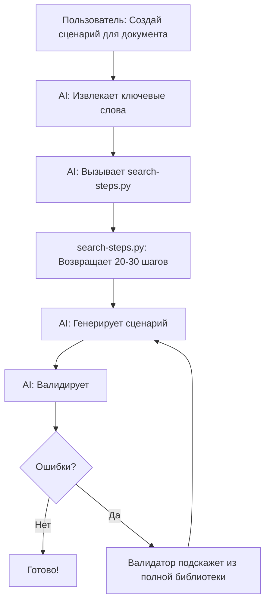

# Search Steps: Инструмент умного поиска шагов для AI

> **Версия:** 1.0 (ТЗ)  
> **Статус:** Проектирование  
> **Дата:** Ноябрь 2025

---

## 🎯 Назначение

Инструмент для интеллектуального поиска релевантных шагов Vanessa Automation без необходимости загружать всю библиотеку (1569 шагов, 655 KB) в контекст AI.

**Основная задача:** Позволить AI работать с минимальным контекстом (`guide.md` + `templates.md` = 58 KB), а нужные шаги находить динамически через поиск.

---

## 💡 Концепция

### Проблема

При использовании 🔴 **сверх-экономной стратегии**:
- AI загружает только `guide.md` + `templates.md` (~58 KB)
- Знает ~50-100 примеров шагов из 1569
- При генерации может не знать точный синтаксис нужного шага
- Приходится полагаться на валидатор для исправления

### Решение

**Умный поиск шагов:**
1. AI анализирует требование пользователя
2. Извлекает ключевые слова ("документ", "таблица", "провести")
3. Вызывает `search-steps.py` с batch-запросом
4. Получает ~20-30 релевантных шагов
5. Генерирует сценарий используя найденные шаги
6. Валидатор проверяет (меньше ошибок!)

**Экономия:**
- Контекст: 58 KB (guide + templates) + 10-20 KB (найденные шаги) = ~70-80 KB
- Вместо 655 KB (полная библиотека)
- **Экономия: ~85-90%** при сохранении высокого качества

---

## 🏗️ Архитектура

### Входные данные

**Источник:** `data/library-full.json` (1569 шагов с категориями)

**Индексы (создаются автоматически):**
```
data/indexes/
├── index.json                  # Метаданные индексов
├── by-category.json            # Индекс по категориям (13 категорий)
├── by-keywords.json            # Инвертированный индекс (ключевое слово → шаги)
└── frequency.json              # Частотность использования шагов
```

### Алгоритм поиска

```python
def search_steps(queries: List[str], top_n: int = 10, category: str = None) -> Dict:
    """
    Поиск шагов по множественным запросам
    
    Args:
        queries: Список поисковых запросов
        top_n: Количество результатов на запрос
        category: Фильтр по категории (опционально)
    
    Returns:
        Dict с результатами в формате для AI
    """
    results = {}
    
    for query in queries:
        # 1. Токенизация запроса
        tokens = tokenize(query)
        
        # 2. Поиск по инвертированному индексу
        candidates = search_in_index(tokens, category)
        
        # 3. Ранжирование по релевантности
        ranked = rank_by_relevance(query, candidates)
        
        # 4. Топ-N результатов
        results[query] = ranked[:top_n]
    
    return format_for_ai(results)
```

### Ранжирование релевантности

**Факторы (веса):**
1. **Текстовая схожесть** (40%) - SequenceMatcher
2. **Совпадение ключевых слов** (30%) - количество совпавших токенов
3. **Частотность использования** (20%) - популярные шаги выше
4. **Категория** (10%) - бонус за совпадение категории

**Формула:**
```
relevance = 0.4 * similarity + 0.3 * keywords_match + 0.2 * frequency + 0.1 * category_match
```

---

## 📋 Функциональные требования

### FR-1: Batch Search (обязательно)

**Описание:** Поиск по нескольким запросам за один вызов

**Формат вызова:**
```bash
python search-steps.py \
  --query "открыть документ" "заполнить таблицу" "провести документ" \
  --top 5 \
  --format json
```

**Вывод:** Объединенный результат для всех запросов

### FR-2: Фильтрация по категориям

**Описание:** Поиск только в определенных категориях

**Формат:**
```bash
python search-steps.py \
  --query "нажать кнопку" \
  --category UI \
  --top 10
```

**Категории:** Берутся из `data/statistics.json` (13 категорий)

### FR-3: Форматы вывода

#### JSON (по умолчанию, оптимален для AI)

```json
{
  "total_queries": 3,
  "total_results": 15,
  "results": {
    "открыть документ": [
      {
        "step": "И я открываю навигационную ссылку \"e1cib/data/...\"",
        "category": "UI",
        "subcategory": "Навигационные ссылки",
        "relevance": 0.92,
        "frequency_rank": 15
      },
      {
        "step": "Дано Я открываю форму \"ИмяФормы\"",
        "category": "UI",
        "subcategory": "Формы",
        "relevance": 0.88,
        "frequency_rank": 8
      }
    ],
    "заполнить таблицу": [...],
    "провести документ": [...]
  }
}
```

#### Human-friendly (для отладки)

```
═══════════════════════════════════════════════════════════════
ПОИСК ШАГОВ VANESSA AUTOMATION
═══════════════════════════════════════════════════════════════

Запросы: 3
Найдено шагов: 15

───────────────────────────────────────────────────────────────
Запрос 1: "открыть документ"
───────────────────────────────────────────────────────────────

1. [UI | 92%] И я открываю навигационную ссылку "e1cib/data/..."
   └─ Категория: Навигационные ссылки
   └─ Частота: #15 (часто используется)

2. [UI | 88%] Дано Я открываю форму "ИмяФормы"
   └─ Категория: Формы
   └─ Частота: #8 (очень часто)

...
```

```bash
python search-steps.py --query "открыть документ" --format human
```

#### Compact YAML (для экономии токенов при необходимости)

```yaml
results:
  открыть документ:
    - И я открываю навигационную ссылку "e1cib/data/..." [UI, 92%]
    - Дано Я открываю форму "ИмяФормы" [UI, 88%]
  заполнить таблицу:
    - И в таблице "Товары" я нажимаю на кнопку "Добавить" [UI, 95%]
```

```bash
python search-steps.py --query "открыть" "таблица" --format yaml-compact
```

### FR-4: Поиск по категориям (get all from category)

**Описание:** Получить все шаги определенной категории

```bash
python search-steps.py --get-category UI --subcategory "Таблицы.Поля"
```

**Применение:** Когда AI знает, что нужна работа с таблицами, загружает все релевантные шаги сразу

### FR-5: Статистика и метаданные

```bash
python search-steps.py --stats
```

**Вывод:**
```json
{
  "total_steps": 1569,
  "categories": 13,
  "top_keywords": [
    {"word": "кнопка", "steps": 156},
    {"word": "таблица", "steps": 142},
    {"word": "поле", "steps": 98}
  ],
  "most_used_steps": [
    {"step": "И я нажимаю на кнопку \"...\"", "usage_count": 245},
    {"step": "И в поле \"...\" я ввожу текст \"...\"", "usage_count": 198}
  ]
}
```

---

## 🔧 Технические требования

### Производительность

| Операция | Требование |
|----------|-----------|
| Инициализация (загрузка индексов) | < 100 мс |
| Поиск по 1 запросу | < 50 мс |
| Batch search (10 запросов) | < 200 мс |
| Создание индексов | < 5 сек |

### Зависимости

- Python 3.6+
- Только стандартная библиотека (как в validator)
- Нет внешних зависимостей

### Совместимость

- Windows, Linux, macOS
- UTF-8 encoding для всех файлов
- Работа из любой директории проекта

---

## 🗂️ Структура файлов

```
tools/search-steps/
├── search_steps.py              # Основной скрипт
├── indexer.py                   # Создание индексов
├── README.md                    # Этот файл
├── SPEC.md                      # Детальная спецификация
└── examples.md                  # Примеры использования

data/indexes/                    # Создаются автоматически
├── index.json                   # Метаданные
├── by-category.json             # Категории
├── by-keywords.json             # Инвертированный индекс
└── frequency.json               # Частотность
```

---

## 📊 Использование в гибридном workflow

### Сценарий 1: AI генерирует сценарий



**Промпт для AI:**
```
Kilo Code, создай сценарий для создания заказа покупателя.

Перед генерацией найди релевантные шаги:
python tools/search-steps/search_steps.py \
  --query "открыть документ" "создать документ" "заполнить таблицу" "провести" \
  --category UI \
  --top 5

Используй найденные шаги для генерации сценария.
```

### Сценарий 2: AI исправляет ошибки

```
Валидатор: Шаг "И я нажимаю кнопку Записать" не найден

AI: Поищу правильный вариант
→ python search-steps.py --query "нажать кнопку записать" --top 3

Результат: 
1. И я нажимаю на кнопку "..." [95%]
2. И я нажимаю кнопку с именем "..." [92%]

AI: Применяю вариант 1
```

---

## 🚀 Roadmap разработки

### Этап 1: MVP (Minimum Viable Product)

**Цель:** Базовый поиск с batch search

**Функционал:**
- ✅ Загрузка library-full.json
- ✅ Простой текстовый поиск (SequenceMatcher)
- ✅ Batch search (несколько запросов)
- ✅ Формат JSON для AI
- ✅ Опция --top N

**Файлы:**
- `search_steps.py` - основной скрипт (~200 строк)

### Этап 2: Индексация

**Цель:** Ускорение поиска через индексы

**Функционал:**
- ✅ Создание инвертированного индекса (ключевое слово → шаги)
- ✅ Индекс по категориям
- ✅ Индекс частотности
- ✅ Скрипт indexer.py для создания индексов

**Файлы:**
- `indexer.py` - создание индексов
- `data/indexes/*.json` - файлы индексов

### Этап 3: Интеграция

**Цель:** Автоматическое обновление индексов

**Функционал:**
- ✅ Интеграция с `update_knowledge_base.py`
- ✅ Автоматическое пересоздание индексов при обновлении библиотеки
- ✅ Проверка актуальности индексов

### Этап 4: Расширенный поиск

**Цель:** Улучшение качества поиска

**Функционал:**
- ✅ Синонимы ("нажать" = "кликнуть" = "щелкнуть")
- ✅ Морфология (учет падежей)
- ✅ Контекстный поиск
- ✅ Ранжирование по популярности

---

## 📖 Примеры использования

### Пример 1: Простой поиск

```bash
python search-steps.py --query "нажать кнопку создать"
```

**Вывод (JSON):**
```json
{
  "query": "нажать кнопку создать",
  "found": 5,
  "results": [
    {
      "step": "И я нажимаю на кнопку \"ЗаголовокКнопки\"",
      "category": "UI",
      "relevance": 0.95
    },
    {
      "step": "И я нажимаю на кнопку с именем \"ИмяКнопки\"",
      "category": "UI",
      "relevance": 0.92
    }
  ]
}
```

### Пример 2: Batch search

```bash
python search-steps.py \
  --query "открыть форму" "заполнить поле" "записать документ" \
  --top 3 \
  --format json
```

**Вывод:**
```json
{
  "total_queries": 3,
  "total_results": 9,
  "results": {
    "открыть форму": [
      {"step": "Дано Я открываю навигационную ссылку \"...\"", "relevance": 0.93},
      {"step": "И я открываю форму \"ИмяФормы\"", "relevance": 0.91},
      {"step": "Тогда открылось окно \"ЗаголовокОкна\"", "relevance": 0.85}
    ],
    "заполнить поле": [...],
    "записать документ": [...]
  }
}
```

### Пример 3: Поиск по категории

```bash
python search-steps.py \
  --query "таблица добавить строку" \
  --category UI \
  --subcategory "Таблицы" \
  --top 5
```

### Пример 4: Получить все шаги категории

```bash
python search-steps.py --get-category "Переменные"
```

**Применение:** AI хочет работать с переменными → загружает все 36 шагов этой категории

---

## 🤖 Интеграция с AI-агентами

### Использование в промптах Kilo Code

**Стратегия:**

1. **AI загружает минимум:** `guide.md` + `templates.md` (58 KB)

2. **AI анализирует запрос** пользователя и извлекает ключевые слова:
   ```
   Пользователь: "Создай сценарий для создания и проведения заказа покупателя"
   
   AI думает:
   - Нужно: открыть документ, создать, заполнить табличную часть, провести
   - Ключевые слова: "открыть документ", "создать", "таблица добавить", "провести"
   ```

3. **AI вызывает search-steps.py:**
   ```bash
   python tools/search-steps/search_steps.py \
     --query "открыть документ" "создать" "таблица добавить товар" "провести документ" \
     --category UI \
     --top 5 \
     --format json
   ```

4. **AI получает ~20 релевантных шагов** и использует их для генерации

5. **AI генерирует сценарий** на основе найденных шагов

6. **AI валидирует** через `validate.py --ai-enhanced`

### Пример промпта для AI

```markdown
WORKFLOW УМНОГО ПОИСКА:

1. Анализирую требование пользователя
2. Извлекаю ключевые слова для действий:
   - Открытие форм/документов
   - Заполнение полей/таблиц
   - Нажатие кнопок
   - Проверки результата
3. Вызываю search-steps.py с batch-запросом:
   python tools/search-steps/search_steps.py \
     --query "<ключевое слово 1>" "<ключевое слово 2>" ... \
     --top 5
4. Получаю ~20-30 релевантных шагов
5. Генерирую сценарий используя найденные шаги
6. Валидирую через validate.py
7. Исправляю по рекомендациям валидатора (если нужно)
```

---

## 💰 Экономика решения

### Сравнение подходов

| Подход | Контекст | Точность (1 попытка) | Итераций | Время |
|--------|----------|---------------------|----------|-------|
| **Полная библиотека** | 655 KB | 75-80% | 2-3 | 5-10 сек |
| **guide.md + templates.md** | 58 KB | 60-70% | 3-5 | 5-15 сек |
| **🌟 Гибридный (search)** | 58 KB + 10-20 KB | 85-90% | 1-2 | 5-12 сек |

### Экономия токенов

**На 1 сессию работы:**
- Традиционный подход: 655 KB загружается 1 раз
- Гибридный подход: 58 KB + (10 KB × 3 запроса) = 88 KB
- **Экономия: ~85%**

**На 10 сценариев:**
- Традиционный: 655 KB (загружается 1 раз, используется для всех)
- Гибридный: 58 KB + (10 KB × 10-15 запросов) = 208 KB
- **Экономия: ~68%**

**Вывод:** Гибридный выгоднее для коротких сессий (1-5 сценариев), традиционный для длинных (10+ сценариев)

---

## 🔄 Интеграция с update_knowledge_base.py

### Расширение update_knowledge_base.py

**Текущий функционал:**
```python
# tools/update_knowledge_base/update_knowledge_base.py
# Создает ai-knowledge/steps-library.json из data/library-full.json
```

**Новый функционал:**
```python
# 1. Создает steps-library.json (как раньше)
create_ai_knowledge_base()

# 2. Создает индексы для search-steps.py (новое!)
create_search_indexes()
  ├─ Инвертированный индекс (ключевое слово → шаги)
  ├─ Категорийный индекс
  └─ Индекс частотности
```

### Процедура обновления

```bash
cd tools/update_knowledge_base/
python update_knowledge_base.py --with-indexes

# Создает:
# - ai-knowledge/steps-library.json
# - data/indexes/index.json
# - data/indexes/by-category.json
# - data/indexes/by-keywords.json
# - data/indexes/frequency.json
```

---

## 📋 Детальная спецификация

### Опции командной строки

```
usage: search_steps.py [-h] [--query QUERY [QUERY ...]] 
                       [--category CATEGORY] [--subcategory SUBCATEGORY]
                       [--top N] [--format {json,yaml,yaml-compact,human}]
                       [--get-category CATEGORY] [--stats]
                       [--library PATH] [--index-dir PATH]

Поиск шагов в библиотеке Vanessa Automation

optional arguments:
  -h, --help            show this help message and exit
  
Поиск:
  --query QUERY [QUERY ...]
                        Поисковые запросы (batch search)
  --category CATEGORY   Фильтр по категории
  --subcategory SUBCATEGORY
                        Фильтр по подкатегории
  --top N               Количество результатов на запрос (default: 10)

Вывод:
  --format {json,yaml,yaml-compact,human}
                        Формат вывода (default: json)

Специальные:
  --get-category CATEGORY
                        Получить все шаги категории
  --stats               Показать статистику библиотеки
  
Пути:
  --library PATH        Путь к library-full.json (default: ../../data/library-full.json)
  --index-dir PATH      Директория индексов (default: ../../data/indexes/)
```

### Примеры использования

```bash
# 1. Простой поиск
python search_steps.py --query "нажать кнопку"

# 2. Batch search
python search_steps.py --query "открыть" "заполнить" "провести" --top 5

# 3. С категорией
python search_steps.py --query "таблица" --category UI --top 10

# 4. Человекочитаемый формат
python search_steps.py --query "документ" --format human

# 5. Получить все шаги переменных
python search_steps.py --get-category "Переменные"

# 6. Статистика
python search_steps.py --stats
```

---

## ✅ Критерии приемки

### Функциональные

- [ ] Поиск по одному запросу работает < 50 мс
- [ ] Batch search до 10 запросов < 200 мс
- [ ] JSON формат валидный и парсится AI
- [ ] Human-friendly формат читаемый человеком
- [ ] Фильтрация по категориям работает
- [ ] Индексы создаются автоматически при первом запуске
- [ ] Работает без внешних зависимостей

### Нефункциональные

- [ ] Код документирован (docstrings)
- [ ] Примеры использования в README
- [ ] Интеграция с update_knowledge_base.py
- [ ] Покрытие тестами (опционально)

---

## 🔗 Связанные документы

- [tools/validator/README.md](../validator/README.md) - Валидатор (использует похожий подход)
- [tools/update_knowledge_base/README.md](../update_knowledge_base/README.md) - Обновление базы знаний
- [docs/kilo-code-workflow.md](../../docs/kilo-code-workflow.md) - Workflow с AI

---

## 🤝 Следующие шаги

1. ✅ Согласовать ТЗ (этот документ)
2. 🔨 Создать MVP search_steps.py
3. 🔨 Создать indexer.py
4. 🔨 Интегрировать с update_knowledge_base.py
5. 📝 Написать примеры использования
6. 🧪 Протестировать с AI
7. 📚 Обновить документацию

---

**Версия:** 1.0  
**Статус:** ТЗ согласовано  
**Автор:** va-ai project team